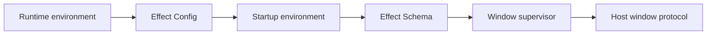

# Issue 1277: Decode startup environment with Effect Config and Schema

## Problem

The runtime startup path reads raw environment records, parses startup-window JSON manually, and validates `WindowSpec` with local type guards. `main.ts` also owns a local truthy-value parser for smoke-test mode. That creates a parallel configuration and decoding layer beside Effect.

## Architecture



`Config` owns environment lookup, missing-value defaults, and boolean parsing. `Schema` owns startup-window and app-descriptor validation. The supervisor keeps only desktop runtime policy: module specifier restrictions, reserved window-name policy, and opening decoded windows through the host client.

## Modules

- `packages/core/src/runtime/window-supervisor.ts`
  - Add a Config-backed startup environment reader.
  - Decode `EFFECT_DESKTOP_STARTUP_WINDOWS` through `Schema.fromJsonString`.
  - Decode module exports through the canonical `DesktopAppDescriptor` shape.
  - Remove the raw env reader, manual JSON parsing, manual window-spec guards, and assertion-style app guard.
- `packages/core/src/runtime/main.ts`
  - Read startup config once and pass decoded values to the supervisor.
  - Remove the local truthy env parser.
- `packages/core/src/runtime/window-supervisor.test.ts`
  - Exercise ConfigProvider-backed decoding, invalid JSON, unsafe names, invalid dimensions, module loading, export selection, and module precedence.
- `packages/core/src/runtime/main.test.ts`
  - Keep runtime smoke tests, but drive smoke mode through the exported env constant.

## Architecture-Debt Sweep

Remove now:

- Raw env object reader API.
- Local `JSON.parse` wrapper.
- Manual `WindowSpec` validation helpers.
- Local truthy env parser in `main.ts`.
- Assertion-style `isDesktopAppConfig` guard.

Keep:

- `toStartupModuleSpecifier`, because it owns desktop-specific dynamic import policy.
- `openDeclaredWindows`, because it translates decoded startup windows into host window lifecycle calls.

No new follow-up issue is needed from this area. The touched wrappers are small enough to remove in this ticket.

## Verification

Focused:

```bash
bun test packages/core/src/runtime/window-supervisor.test.ts packages/core/src/runtime/main.test.ts
bun run typecheck --filter=@effect-desktop/core
bun packages/cli/src/bin.ts check --api
```

Full local gate before push:

```bash
bun run typecheck
bun run lint
bun run lint:types
bun run format:check
bun run check
bun run build
bun test
cargo fmt --check
cargo check --workspace
cargo test --workspace
cargo clippy --workspace --all-targets -- -D warnings
git diff --check
```
