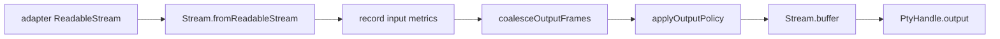

# Issue #1282: Shape PTY Output As Effect Stream Pipelines

## Problem

`PTY` output used a local `Queue`, a producer fiber, manual queue byte accounting, and explicit overflow helpers. That made PTY output lifecycle a parallel stream implementation instead of an Effect `Stream` pipeline.

## Before

```ts
const queue =
  yield * Queue.bounded<QueuedOutput, PtyError | Cause.Done>(outputQueueCapacity(policy))
const producer =
  yield *
  runOutputProducer(source, queue, queuedBytes, command, policy, metrics).pipe(Effect.forkScoped)

return Stream.fromQueue(queue)
```

The producer owned source consumption, coalescing, queue offering, queue shutdown, and failure propagation.

## After

```ts
source.pipe(
  Stream.mapEffect((chunk) => recordInputChunk(metrics, chunk).pipe(Effect.as(chunk))),
  coalesceOutputFrames(policy),
  Stream.mapEffect((frame) => applyOutputPolicy(command, policy, metrics, frame)),
  Stream.filterMap(Filter.fromPredicateOption((frame) => frame)),
  Stream.buffer({ capacity, strategy }),
  Stream.map((frame) => frame.bytes)
)
```

`PTY` still owns desktop policy: byte budgets, coalescing metrics, overflow-to-host-error mapping, and stream output shape. Effect owns stream pulling, buffering, interruption, and sink propagation.

## Architecture



## Verification

- PTY output still exposes byte chunks and exit status.
- Small chunks still coalesce up to the byte window.
- Quiet partial chunks still flush after the coalescing window.
- Oversized chunks still fail with `HostProtocolBackpressureOverflowError` when overflow policy is `error`.
- `dropOldest` still keeps the public output stream bounded through the Effect buffer strategy.
- Existing PTY lifecycle, permission, write, resize, kill, and scope-close tests still pass.

## Architecture-Debt Sweep

Removed now: PTY output queue, queue producer fiber, queue room helper, manual queue shutdown, and queue byte/depth accounting as a local stream implementation.

Kept now: PTY service boundary, because it owns permissions, owner scopes, resource registry handles, resize/write/kill validation, child shutdown policy, output metrics, and host-protocol error mapping.

Follow-up opened: #1298 owns the remaining detached PTY child-exit observer with scopes. That lifecycle change is separate from output streaming because observer-initiated disposal must avoid re-entrant self-interruption.
