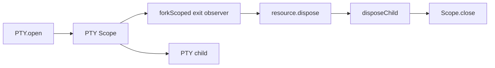

# Issue #1298: Own PTY Exit Observers With Scopes

## Problem

`PTY` still observed child exit with detached `Effect.runFork`. That made the exit observer live outside the PTY resource lifetime even though the child, budget, and registry handle are all owned by the PTY service.

## Before

```ts
const observeChildExit = (exitStatus, resource, command): void => {
  Effect.runFork(
    exitStatus.pipe(
      Effect.exit,
      Effect.flatMap((exit) => resource.dispose().pipe(/* log failure */))
    )
  )
}
```

The observer fiber was not scoped. Registry disposal, natural child exit, and interruption were coordinated by convention.

## After

```ts
const ptyScope = yield * Scope.make()
const disposalOrigin = yield * Ref.make<PtyDisposalOrigin>("running")

yield *
  observeChildExit(exitStatus, resource, command, ptyScope, disposalOrigin).pipe(
    Scope.provide(ptyScope)
  )
```

The observer is forked with `Effect.forkScoped({ startImmediately: true })` inside the PTY scope. Registry-driven disposal closes that scope. Observer-driven disposal marks its origin first so registry cleanup does not interrupt the observer before cleanup completes.

## Architecture



`PTY` keeps desktop policy: permissions, owner scopes, resource registry integration, resize/write/kill validation, child shutdown policy, output metrics, and host-protocol errors. Effect owns the observer fiber lifetime.

## Verification

- Natural child exit removes the resource without awaiting `onExit`.
- Scope close still kills the child.
- Scope close still waits for child exit before releasing budget.
- Failed child exit still logs and releases budget for a later open.
- `packages/core/src/runtime/pty.ts` no longer contains `Effect.runFork`.

## Architecture-Debt Sweep

Removed now: detached PTY child-exit observer.

Kept now: PTY service boundary, because it owns durable desktop PTY policy. PTY budget counters remain nearby architecture debt and are already tracked by #1183.
