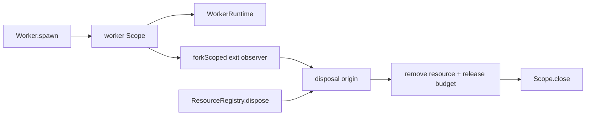

# Issue #1299: Own Worker Exit Observers With Scopes

## Problem

After #1160, the default Bun worker adapter uses Effect worker primitives, but `Worker.spawn`
still starts the runtime-exit observer with detached `Effect.runFork`. That makes the observer
the last worker lifecycle fiber outside Effect scope ownership.

## Before

```ts
const observeWorkerExit = (exit, resource, script): void => {
  Effect.runFork(
    exit.pipe(
      Effect.exit,
      Effect.flatMap((result) => resource.dispose().pipe(/* log failure */))
    )
  )
}
```

The observer can outlive the worker resource owner, and cleanup relies on convention instead of a
scope.

## After

```ts
const workerScope = yield * Scope.make()
const disposalOrigin = yield * Ref.make<WorkerDisposalOrigin>("running")

yield *
  observeWorkerExit(runtime.exit, resource, input.script, workerScope, disposalOrigin).pipe(
    Scope.provide(workerScope)
  )
```

The observer is a `forkScoped` fiber owned by the worker scope. Registry-driven disposal claims
the lifecycle before shutting down the runtime. Observer-driven disposal claims it before removing
the resource, then closes the worker scope itself so it does not interrupt its own `resource.dispose`
call.

## Architecture



`Worker` keeps desktop semantics: permission checks, channel decoding, resource registry ownership,
owner-scope snapshots, shutdown policy, and the temporary manual budget release. Effect owns the
observer fiber lifetime.

## Verification

- `packages/core/src/runtime/worker.ts` contains no `Effect.runFork`.
- Worker self-exit still removes the resource and releases the owner budget.
- Owner-scope close completes even when the runtime exit effect never resolves.
- Crash logging still preserves the original worker failure.

## Architecture-Debt Sweep

Removed now: the last detached worker lifecycle observer.

Kept intentionally:

- Manual worker budget counters remain for #1172.
- The message queue bridge remains for #1189.
