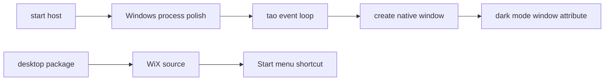

# Issue 102 Architect

## Decision

Implement Windows polish as two narrow owners: `crates/host` owns process/window WinAPI policy, and `packages/cli` owns MSI shortcut metadata.

## Problem

Windows users need per-monitor DPI behavior, system-dark window styling, taskbar grouping by app identity, and installer-created shortcuts. The repo currently has a host window path and a WiX MSI generator, but no single owner for Windows process/window policy or Start menu shortcut metadata.

## Architecture

`WindowsPolish` in `crates/host` is a small platform module. On Windows it applies process-level DPI awareness and AppUserModelID before the event loop runs, and applies immersive dark-mode attributes after each native window is created. On non-Windows it compiles to typed no-ops so shared host code does not branch on platform details.

The MSI generator adds Start menu shortcut metadata to the existing per-user WiX package. This keeps shortcut creation at install time, where the issue says it belongs, and avoids runtime self-modification.

## Modules

| Module                | Responsibility                                      | Interface                                     | Hidden detail                        |
| --------------------- | --------------------------------------------------- | --------------------------------------------- | ------------------------------------ |
| `crates/host/windows` | Windows DPI, AppUserModelID, dark-mode window hooks | `apply_process_polish`, `apply_window_polish` | WinAPI calls and platform cfg gates  |
| `packages/cli`        | MSI shortcut metadata                               | existing `desktop package` command            | WiX directory/component/shortcut XML |

## Verification

- Unit-test the host policy shape on non-Windows through no-op return values and config validation.
- Unit-test generated WiX source contains Start menu shortcut metadata, remove-folder cleanup, and app identity.
- Run focused Rust and CLI tests, then the repo validation subset required by Phase 23.

## Handoff

Architecture locked. Continue to `/review`.
