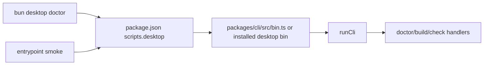

# Issue 770 Architecture: Documented desktop entrypoint

## Problem

The documented command name is `bun desktop`, but a project root without a `desktop` script or installed `desktop` bin cannot invoke the CLI at all.

## Game board

- Players: app developers, framework maintainers, CI, generated-template authors.
- Incentives: maintainers can keep using `bun packages/cli/src/bin.ts` because it is direct and already works.
- Information asymmetries: internal CLI-path tests prove command behavior after startup, but do not prove public command resolution.
- Bad equilibrium: docs keep promising `bun desktop` while tests exercise only monorepo source paths.
- Desired equilibrium: the command users see is the command CI smokes.

## Constraints

- `docs/SPEC.md` is normative and names `bun desktop *` as the public command form.
- Bun resolves `bun <name>` through package scripts and `node_modules/.bin`; without either, it fails before CLI code runs.
- `packages/cli/src/bin.ts` remains the single CLI implementation entrypoint.
- Standalone CLI package installability is issue #769 and stays out of this issue except as a queued dependency risk.
- Generated app roots must expose the same command shape.

## Grounding findings

- `bun desktop doctor --config apps/playground/desktop.config.ts` currently exits with `error: Script not found "desktop"`.
- Root `package.json` has no `desktop` script.
- `packages/cli/package.json` declares `bin.desktop`, but that does not create a root command by itself.
- `templates/basic-react-tailwind/package.json` has no `desktop` script.
- Existing tests exercise `runCli` and `bun packages/cli/src/bin.ts`, not the documented `bun desktop` boundary.

## Core trade-off

I am trading a small amount of manifest duplication for command honesty at every project boundary.

## Architecture

Expose `desktop` as an explicit package script at project roots that are meant to run the framework command. The repo root script delegates to the checked-in CLI bin source. The template script delegates to the installed `desktop` bin supplied by the explicit `@effect-desktop/cli` dependency, so generated app users do not need to know the monorepo source path.

Add one command-resolution smoke that launches the documented root command through Bun instead of calling `runCli` directly. Keep deeper CLI behavior tests on `runCli`, because this issue is about command discovery before startup, not command semantics after startup.

## Modules

| Module                      | Responsibility                            | Interface                                                     | Hides                            | Dependency                                  | State             | Error model                                          | Incentive effect                                                        | Tests                                  |
| --------------------------- | ----------------------------------------- | ------------------------------------------------------------- | -------------------------------- | ------------------------------------------- | ----------------- | ---------------------------------------------------- | ----------------------------------------------------------------------- | -------------------------------------- |
| Root command entrypoint     | Make documented repo command resolve      | `package.json#scripts.desktop`                                | CLI source path                  | in-process                                  | none              | Bun exits non-zero if target cannot be launched      | Maintainers can run the public command cheaply                          | Smoke `bun desktop ...` from repo root |
| Template command entrypoint | Make generated app command shape explicit | `templates/basic-react-tailwind/package.json#scripts.desktop` | Package-manager bin lookup       | true-external at generated app install time | none              | Bun/package manager failure is visible               | Template users get the documented command without source-path knowledge | Package manifest assertion             |
| CLI bin                     | Execute the real CLI implementation       | `packages/cli/src/bin.ts` and `bin.desktop`                   | `runCli` wiring and process exit | in-process                                  | process exit only | CLI returns typed errors as exit codes after startup | Keeps command behavior centralized                                      | Existing CLI tests                     |

## Principle Fit

- Simplicity: no new command runner, wrapper package, or release rewrite is added.
- Deep modules: the CLI remains the deep module; manifests only expose the command boundary.
- Single source of truth: command behavior stays in `packages/cli/src/bin.ts`; scripts only point at it.
- Failure visibility: missing command resolution remains loud through Bun's exit code.
- Effect discipline: no new effectful TypeScript code is introduced.

## Quality Attributes

- Performance: one script hop before the existing CLI process.
- Reliability: command resolution is exercised by an end-to-end smoke instead of inferred from direct unit tests.
- Security: no new authority; scripts launch the same local CLI code or declared package bin.
- Migration: existing internal test invocations can remain while the public path gains coverage.

## Non-goals

- Fixing standalone `@effect-desktop/cli` installability from `file:` dependencies (#769).
- Rewriting publish manifests or package dependency specs.
- Implementing missing CLI subcommands.

## Handoff

Architecture derived. Continue to `/review`.
