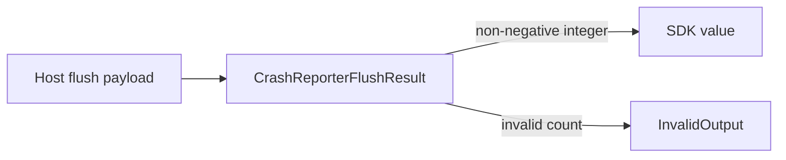

# Issue 812 Architecture: Validate CrashReporter.flush Output Counts

## Decision

Decode `CrashReporter.flush` output with a non-negative integer schema.

## Problem

`CrashReporterFlushResult.flushed` is currently a raw number. That accepts negative, fractional, `NaN`, and infinite values even though the value is a count returned by the host.

## Constraints

- A count cannot be negative or fractional.
- Host output is trusted only after schema decoding.
- Invalid host output must fail as `InvalidOutput`, not produce an SDK value.
- The existing valid `{ flushed: 1 }` behavior must remain valid; `{ flushed: 0 }` must also be valid.

## Architecture

## Module

`packages/native/src/contracts/crash-reporter.ts` owns the output contract. Add a private `CrashReporterFlushCount` schema and use it for `CrashReporterFlushResult.flushed`.

## Verification

- Valid zero and positive counts decode.
- Negative, fractional, `NaN`, and infinite counts fail as `InvalidOutput`.

Handoff: `/review`
