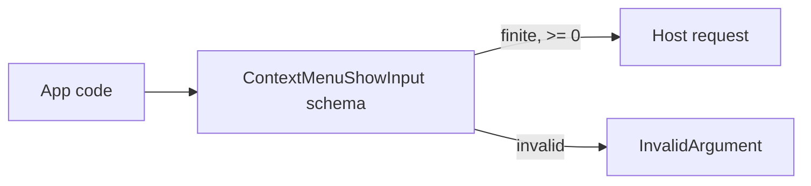

# Issue 813 Architecture: Validate ContextMenu.show Position Coordinates

## Decision

Validate `ContextMenu.show` popup coordinates as finite, non-negative logical pixels before a bridge request is built.

## Problem

`ContextMenu.show` accepts raw numbers for `position.x` and `position.y`. JavaScript can hold `NaN` and infinities, but JSON cannot represent them; serialization turns those values into `null`. Negative coordinates are also accepted even though the position is window-local, not screen-global.

## Constraints

- `docs/SPEC.md` defines native primitive coordinates as logical pixels unless explicitly physical.
- Context menu positions are relative to the target window.
- Fractional logical pixels are valid because subpixel placement is a normal renderer coordinate.
- Bridge clients must reject invalid arguments before transport.

## Architecture

## Module

`packages/native/src/contracts/context-menu.ts` owns the boundary. Add a private coordinate schema and use it for both `ContextMenuPosition.x` and `ContextMenuPosition.y`.

The schema hides the coordinate policy in one place. Callers keep the same public shape: `{ x: number, y: number }`.

## Verification

- `NaN`, `Infinity`, and `-Infinity` fail as `InvalidArgument`.
- Negative `x` or `y` fails as `InvalidArgument`.
- No host request is recorded for invalid positions.
- A finite fractional position still reaches the bridge request unchanged.

Handoff: `/review`
