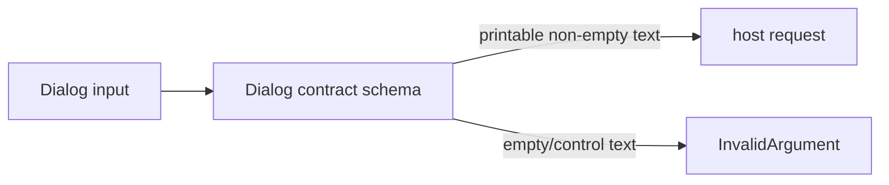

# Issue 815 Architecture

Decision: put one native dialog display-text schema in `packages/native/src/contracts/dialog.ts` and use it for every platform-visible Dialog string before bridge transport.

The current truth is that Dialog bridge clients already decode method inputs before sending host envelopes, and `defaultPath` already rejects NUL bytes. The gap is that titles, details, message text, and button labels are display strings but currently accept control bytes that native adapters may normalize inconsistently or render poorly. The invariant is that the host must receive only printable UI text for native dialog chrome.

The trade-off is rejecting empty optional strings when present. Omission already means "use the platform default"; an empty provided title or label is ambiguous and should fail at the same boundary as control bytes.

Modules:

| Module                 | Responsibility                              | Interface            | Hides                        |
| ---------------------- | ------------------------------------------- | -------------------- | ---------------------------- |
| Dialog contract schema | Classify native UI strings before transport | `DialogDisplayText`  | display-string byte policy   |
| Dialog bridge client   | Decode inputs and stop invalid requests     | `decodeDialog*Input` | transport error construction |
| Dialog regression test | Prove invalid UI text sends no host request | bridge client smoke  | platform adapter absence     |
