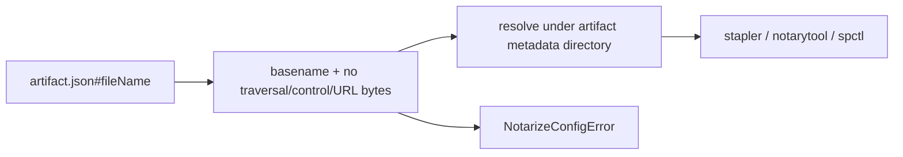

# Architecture

Decision: resolve notarization artifact paths through a private basename validator at metadata discovery time.

Current state: packaged artifact metadata supplies `fileName`, and notarization uses that value to find the artifact.
Constraint: metadata may be stale or tampered with, and notarization submits files to external Apple tooling.
Desired state: metadata can name only the artifact inside its own metadata directory.

Trade-off: this rejects any nested artifact path, even if contained. That is correct because package metadata currently writes basenames, and a nested path would expand the notarization trust boundary without a product requirement.

Mechanism:

Modules:

- `packages/cli/src/notarization-pipeline.ts`: add a private resolver used by `readPackagedArtifacts`.
- `packages/cli/src/index.test.ts`: add a traversal/path-shaped regression that records command invocations and expects none.
