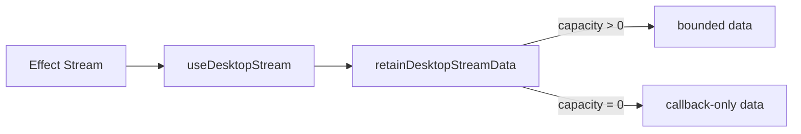

# Issue 841 Architecture: Bound React Stream Hook Retention

## Decision

Make `useDesktopStream` retention explicit and bounded, with a default retained-item capacity of 1024.

## Problem

The hook currently appends every stream item into React state forever. That defeats bounded bridge/runtime stream contracts at the public React boundary and creates quadratic copying over long-lived streams.

## Constraints

- Preserve the existing `useDesktopStream(stream, deps)` call shape.
- Avoid adding a browser test harness or new dependency for this narrow change.
- Let long-lived consumers avoid retaining data while still observing items.
- Reject invalid retention capacities instead of silently clamping.

## Architecture

## Module

`packages/react/src/index.ts` owns the hook contract. Add `DesktopStreamOptions`, bounded retention, an optional `onItem` callback, and a pure retention helper used by the hook and tests.

## Verification

- More emitted items than capacity retain only the newest items.
- `capacity: 0` stores no items.
- Invalid capacities throw.
- Existing server-render hook tests keep the initial idle state behavior.

Handoff: `/review`
