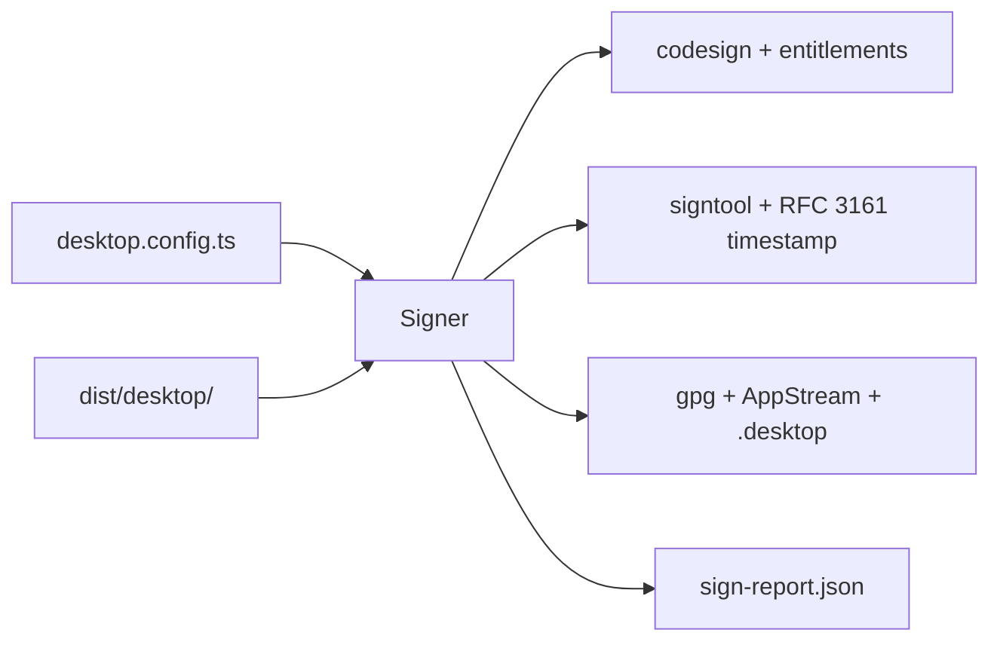

# Issue 85 Architecture: Code Signing

## Mechanism in one sentence

`desktop sign` reads packaged artifacts, derives one platform signing plan, generates required sidecar policy files, and invokes only the signer commands allowed for that platform.

## Architecture sketch

The CLI delegates signing to one deep module, `Signer`. The module owns config validation, artifact discovery, entitlement/AppStream generation, command argument composition, and the final sign report. It returns typed failures; the CLI only formats them.

## Modules

| Module      | Responsibility                                       | Public surface                     | Hides                                                                     | Invariant                                                                               | Pure/effectful                                  |
| ----------- | ---------------------------------------------------- | ---------------------------------- | ------------------------------------------------------------------------- | --------------------------------------------------------------------------------------- | ----------------------------------------------- |
| `Signer`    | Sign packaged artifacts for one host-matching target | `runDesktopSign`, `runSignCommand` | artifact naming, command flags, entitlement/AppStream XML, MOTW stripping | Every selected artifact gets the platform-required signing treatment or a typed failure | Effectful shell with pure formatters/generators |
| CLI adapter | Parse `desktop sign` flags and format reports/errors | `runCli` dispatch                  | stdout/stderr policy and usage errors                                     | Tool errors become values and exit codes                                                | Effectful                                       |

## State placement

Signing state is derived from config and filesystem artifacts. The only persisted state written by this issue is generated signing sidecars and `sign-report.json` under the existing packaged output root.

## Ports and adapters

| Port                | Adapter                                 | Failure model                                            |
| ------------------- | --------------------------------------- | -------------------------------------------------------- |
| `SignCommandRunner` | `Bun.spawn` runner, injectable in tests | `SignCommandFailedError` with command, step, cwd, stderr |
| Filesystem          | `Effect.tryPromise` wrappers            | `SignFileError` with operation/path/cause                |
| Config import       | dynamic `import()` from config path     | `SignConfigError`                                        |

## Lifecycle and recovery

`planned -> sidecars-written -> commands-run -> report-written -> signed`. Any missing config, missing artifact, unsupported target, or command failure stops the lifecycle with a tagged error and remediation text; no fallback signs with weaker defaults.

## Trade-off

This trades broad installer introspection for a small first-party signing plan over the artifacts Phase 21 emits, because notarization, update manifests, and HSM-backed keys are separate issues.

## Quality notes

Tests cover command composition and generated policy files without requiring real certificates. Manual gates remain the platform verification commands named in the issue: `codesign --verify --strict --deep`, `signtool verify /pa`, and offline GPG verification.

## Open questions

Windows signing inside MSI payload extraction is represented by explicit MOTW stripping over artifact files in this slice; deeper MSI table mutation belongs to a follow-up only if verification shows packaged binaries remain unsigned inside the installer.

## Handoff

Architecture derived. Continue to `/review`.
