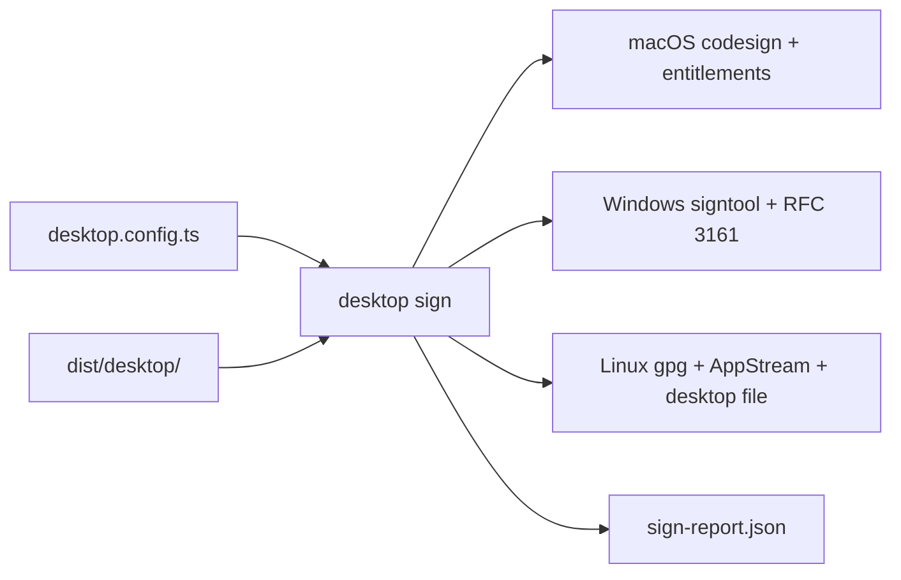

# Issue 85 PR

## PR

- Number: #257
- URL: <https://github.com/Rika-Labs/effect-desktop/pull/257>
- Title: add desktop signing pipeline

Body:

````markdown
## Summary

Adds `desktop sign` as the Phase 22 signer entry point for packaged artifacts. The signer owns platform command composition and generated signing metadata so callers cannot weaken hardened runtime entitlements, RFC 3161 timestamping, or Linux AppImage signing defaults. The trade-off is that this slice signs only artifacts with direct first-party hooks while notarization, update manifests, channels, rollback, and HSM custody stay in later issues.

## Flow


````

Closes #85

```

## CI status

- `validate (blacksmith-2vcpu-ubuntu-2404)` — pass, 2m32s
- `validate (blacksmith-2vcpu-windows-2025)` — pass, 2m26s
- `validate (blacksmith-6vcpu-macos-latest)` — pass, 57s

Final summary: all-green.

## Linked issues

- Closes #85.

## Open issues

None.

## Handoff

PR ready. Continue to `/code-review`.
```
