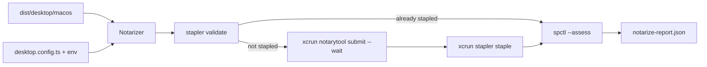

# Issue 86 Architecture: macOS Notarization

## Mechanism in one sentence

`desktop notarize` discovers signed macOS artifacts, validates whether a staple already exists, submits unstapled artifacts with `notarytool --wait`, staples them, assesses them with Gatekeeper, and writes a notarization report.

## Architecture sketch

One `Notarizer` module owns the macOS-only lifecycle and command output interpretation. The CLI parses flags and formats reports; it does not decide whether validation failure means "already stapled" or "needs notarization".

## Modules

| Module      | Responsibility                                         | Public surface                             | Hides                                                                              | Invariant                                                    | Pure/effectful                    |
| ----------- | ------------------------------------------------------ | ------------------------------------------ | ---------------------------------------------------------------------------------- | ------------------------------------------------------------ | --------------------------------- |
| `Notarizer` | Notarize, staple, validate, and assess macOS artifacts | `runDesktopNotarize`, `runNotarizeCommand` | notarytool/stapler/spctl flags, idempotency, credential resolution, output parsing | An unstapled macOS artifact cannot be reported release-ready | Effectful shell with pure parsers |
| CLI adapter | Parse `desktop notarize` and format reports/errors     | `runCli` dispatch                          | output routing and usage                                                           | Tool failures become values and exit codes                   | Effectful                         |

## State placement

State is derived from packaged artifact metadata and command outputs. The only persisted state is `notarize-report.json` under `dist/desktop/macos`.

## Ports and adapters

| Port                    | Adapter                                  | Failure model                                                                     |
| ----------------------- | ---------------------------------------- | --------------------------------------------------------------------------------- |
| `NotarizeCommandRunner` | `Bun.spawn` exec-form runner             | Spawn failures become `NotarizeCommandFailedError`; process exit codes are values |
| Filesystem              | `Effect.tryPromise` wrappers             | `NotarizeFileError`                                                               |
| Config/env              | dynamic config import plus `process.env` | `NotarizeConfigError`                                                             |

## Lifecycle and recovery

Each artifact moves through `discovered -> validate-staple -> already-stapled | submitted -> stapled -> assessed -> reported`. Non-zero submit/staple/assess exits fail with typed command errors. Non-zero validate exits mean the artifact is unstapled and should be submitted.

## Trade-off

This trades generalized Apple credential modeling for a small keychain-profile-or-env credential contract, because HSM/key custody and release secret policy are Phase 24.

## Quality notes

Tests should cover already-stapled idempotency, submit/staple/assess sequencing, redacted credential reporting, and rejection/log propagation.

## Open questions

Zip notarization/stapling remains constrained by Apple tool support: `stapler` supports disk images, executable bundles, and flat installer packages, not zip archives.

## Handoff

Architecture derived. Continue to `/review`.
