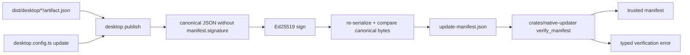

# Issue 87 Architecture: Update Manifest Format and Signature Verification

## Mechanism in one sentence

`desktop publish` turns packaged release artifacts into one canonical JSON update manifest, signs the canonical bytes with Ed25519, and `crates/native-updater` verifies those same canonical bytes against a bounded key-version window.

## Architecture sketch

One `UpdateManifest` mechanism owns the stable bytes. The TypeScript CLI builds and signs manifests because it owns release artifact discovery and config loading; Rust verifies manifests because the installed updater and host need one native trust decision.

## Modules

| Module                      | Responsibility                                                                                                         | Public surface                                      | Hides                                                                                    | Invariant protected                                                                               | Pure/effectful                             |
| --------------------------- | ---------------------------------------------------------------------------------------------------------------------- | --------------------------------------------------- | ---------------------------------------------------------------------------------------- | ------------------------------------------------------------------------------------------------- | ------------------------------------------ |
| `UpdateManifest` CLI module | Discover package metadata, build schema fields, canonicalize, sign, verify stability, and write `update-manifest.json` | `runDesktopPublish`, `canonicalUpdateManifestBytes` | field ordering, artifact discovery, private-key env resolution, Ed25519 invocation shape | A release manifest has one signed byte representation                                             | Effectful shell with pure canonicalization |
| CLI adapter                 | Parse `desktop publish` flags and format reports/errors                                                                | `runCli` dispatch                                   | stdout/stderr and usage                                                                  | Failures become values and exit codes                                                             | Effectful                                  |
| `crates/native-updater`     | Parse signed manifest JSON and verify Ed25519 signatures with key rotation window                                      | `verify_manifest`, `canonical_manifest_bytes`       | serde shape, base64 decoding, key-window policy                                          | A client accepts only manifests signed by a trusted key version in `[keyVersion - 2, keyVersion]` | Pure Rust                                  |

## State placement

The manifest is derived release state. `desktop publish` is the only writer and persists `update-manifest.json` under the app's desktop dist directory. Clients read the manifest as immutable input. Trust anchors are caller-provided data; the verifier does not fetch keys or mutate state.

## Ports and adapters

| Port            | Adapter                                            | Invariants                                                                                    | Failure model           |
| --------------- | -------------------------------------------------- | --------------------------------------------------------------------------------------------- | ----------------------- |
| Filesystem      | `Effect.tryPromise` wrappers in the publish module | Existing package metadata must be read before signing                                         | `PublishFileError`      |
| Config/env      | Dynamic config import plus explicit env lookup     | Local artifacts are checked before release secrets; private keys are never written to reports | `PublishConfigError`    |
| Ed25519 signing | Node/Bun `crypto.sign(null, bytes, privateKey)`    | Signature covers canonical bytes only                                                         | `PublishSignatureError` |
| Native verifier | `ed25519-dalek` strict verification                | Weak keys and invalid signatures reject as typed errors                                       | `UpdateManifestError`   |

## Lifecycle and recovery

Publish lifecycle: `load-config -> discover-artifacts -> resolve-release-key -> build-manifest -> canonicalize -> sign-artifacts -> sign-manifest -> re-canonicalize -> write-report`. Any invalid field, missing artifact, unstable encoding, or failed signature becomes a typed error. Verification lifecycle: `parse-json -> remove-signature -> canonicalize -> select-trust-window -> verify-signature -> accepted | rejected`.

## Trade-off

This trades a full key-management subsystem for an explicit `privateKeyEnv` publish input, because HSM-backed custody and rotation tooling are Phase 24 while this issue needs a verifiable manifest format now.

## Quality notes

- Security: private key input stays env-only and is not persisted; public trust anchors are explicit.
- Testability: canonicalization is pure and can be tested against reordered fields; command I/O is outside the core.
- Reliability: key rotation is bounded by a constant window, not caller convention.
- Agent navigability: TypeScript publish and Rust verify each expose one narrow public entry point.

## Open questions

Channel routing, install staging, rollback application, and HSM-backed release keys remain in issues #88, #89, and Phase 24.

## Handoff

Architecture derived. Continue to `/review`.
