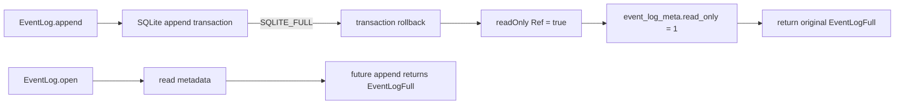

## Problem

`EventLog.append` already knows how to deny writes when durable metadata says the namespace is read-only, but the `SQLITE_FULL` transition only updated process memory.

## Constraints

- Keep the public `EventLogStore.append` contract unchanged.
- Preserve the original `EventLogFull` error when metadata persistence fails.
- Do not move app logic into SQLite or broaden the SQLite port.
- Keep committed events queryable after the transition.

## Core trade-off

I am trading one best-effort metadata write for durable fail-closed behavior across process restarts.

## Architecture

When append maps a failed transaction to `EventLogFull`, update the in-memory latch first, then attempt `UPDATE event_log_meta SET read_only = 1 WHERE namespace = ?` on the same serialized SQLite connection. The metadata update runs after the failed append transaction has rolled back, so it can commit independently. If that metadata update fails, preserve the original `EventLogFull`; there is no better error to return because the user-visible operation already failed due to disk-full pressure.

## Modules

- `EventLog.append`: owns the failure transition ordering and preserves the typed append error.
- `event_log_meta`: stores namespace write-safety state across reopen.
- `EventLog` tests: inject one SQLite full failure on event insert, reopen with a normal adapter, and prove append remains denied from metadata.

## Handoff

Handoff: `/review`
