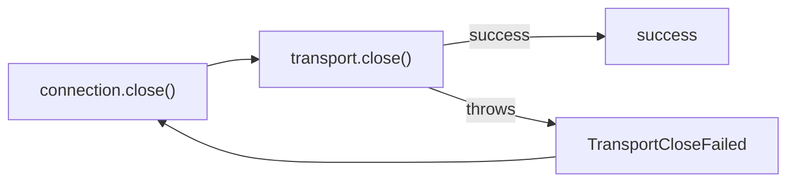

## Problem

Transport close failures currently disappear as success, so the runtime cannot observe failed pipe, stream, or iterator release.

## Constraints

- Keep framing, send, and receive behavior unchanged.
- Preserve Effect-first typed errors in runtime code.
- Avoid a broad telemetry subsystem for this narrow lifecycle boundary.
- Keep the connection interface narrow.

## Core trade-off

I am trading a small close signature widening for honest cleanup semantics.

## Architecture

Make `TransportConnection.close` return `Effect.Effect<void, TransportError, never>`. Add a close-specific `TransportCloseFailed` error so callers and tests can tell close failures from send failures. `makeConnection(...).close()` maps exceptions from `transport.close()` to that error with operation `<operation>.close`; in-memory queued transports keep returning success because their shutdown path is already typed and infallible.

## Modules

- Transport errors: add `TransportCloseFailed` to the closed union.
- Transport connection: make close fallible and map adapter exceptions.
- Transport tests: reproduce a thrown close and assert a typed close error.

## Handoff

Handoff: `/review`
