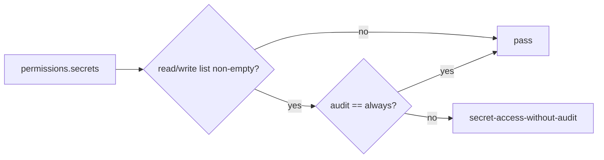

# Issue 872 Architecture - Require audit for wildcard secret access

## Decision

Secret audit enforcement should depend on whether secret access is declared, not whether the declaration is scoped.

## Problem

- The production checker has a rule for `secret-access-without-audit`.
- Secret read/write lists grant access whether they contain concrete namespaces or `"*"`.
- The current rule reuses a scope predicate that intentionally rejects wildcard lists.

## Architecture

Add a small local predicate for declared secret access:

## Modules

- `packages/config/src/index.ts`: replace the secret rule's `hasScopedList` check with a non-empty read/write check.
- `packages/config/src/index.test.ts`: add regressions for wildcard read/write without always-on audit and no-access config without audit.

## Trade-off

This adds one predicate instead of changing `hasScopedList`; that preserves filesystem/process semantics and keeps the fix local.
