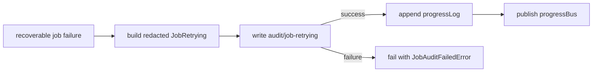

# Issue 875 Architecture - Publish job retry progress after audit success

## Decision

`emitRetrying` should treat audit success as the commit point for retry progress.

## Problem

- Retry progress and retry audit describe the same operational event.
- The current code mutates in-memory progress state before the durable audit write.
- If audit fails, callers can replay a retry event that the audit log never accepted.

## Architecture

## Modules

- `packages/core/src/runtime/job.ts`: reorder `emitRetrying` so audit write happens before `progressLog` and `progressBus`.
- `packages/core/src/runtime/job.test.ts`: add a regression where retry audit fails and no `JobRetrying` is replayable.

## Trade-off

This preserves one source of truth for retry evidence at the cost of delaying live progress publication until audit accepts the row.
