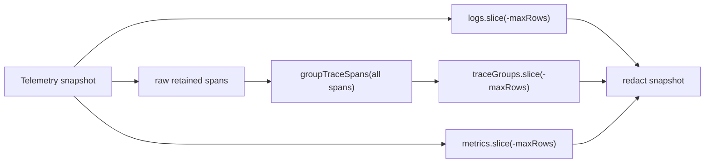

# Architecture

`DiagnosticsPanels` should cap traces as trace groups, not raw spans.

The system has three facts:

- `Telemetry` owns a bounded raw span ring.
- `DiagnosticsPanels` owns the trace projection shown to users.
- A returned child span with a missing returned parent is a false diagnostic unless the API says the group was truncated.

The smallest correct change is to group all retained telemetry spans first, sort spans inside each group as today, then apply `maxRows` to the trace-group array. Logs and metrics keep their existing independent row caps. This trades exact raw-span count parity for trace integrity; the telemetry ring still bounds memory, and the diagnostics API stays unchanged.

## Modules

- `packages/devtools/src/diagnostics-panels.ts` owns the projection change by moving `slice(-maxRows)` after `groupTraceSpans`.
- `packages/devtools/src/index.test.ts` owns the regression: a root and child in the same trace with `maxRows: 1` must return both spans in one group.

## Verification

- Run the issue reproduction before and after the change.
- Run `bun test packages/devtools/src/index.test.ts`.
- Run the standard TypeScript/lint/format checks needed for touched files.

Handoff: `/review`
