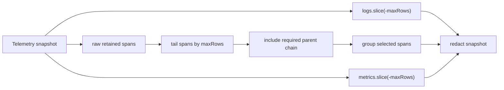

# Architecture

`DiagnosticsPanels` should cap traces as trace groups, not raw spans.

The system has three facts:

- `Telemetry` owns a bounded raw span ring.
- `DiagnosticsPanels` owns the trace projection shown to users.
- A returned child span with a missing returned parent is a false diagnostic unless the API says the group was truncated.

The smallest correct change is to keep the capped raw tail as the recency source, then include only the parent chain needed by spans in that tail before grouping. Logs and metrics keep their existing independent row caps. This trades exact raw-span count parity for trace integrity; the telemetry ring still bounds memory, and diagnostics avoids grouping the entire trace ring on every frame.

## Modules

- `packages/devtools/src/diagnostics-panels.ts` owns the projection change by selecting the capped tail plus required parent spans before `groupTraceSpans`.
- `packages/devtools/src/index.test.ts` owns the regressions: a root and child in the same trace with `maxRows: 1` must return both spans in one group, and the capped projection must follow latest span activity rather than first-seen trace insertion order.

## Verification

- Run the issue reproduction before and after the change.
- Run `bun test packages/devtools/src/index.test.ts`.
- Run the standard TypeScript/lint/format checks needed for touched files.

Handoff: `/review`
