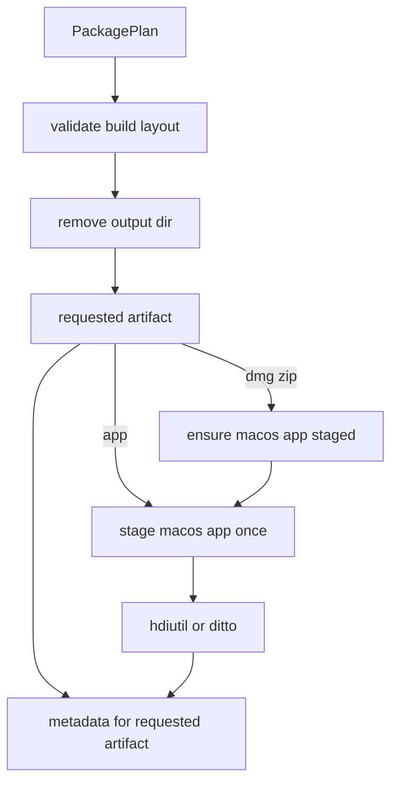

## Problem

MacOS secondary package artifacts currently depend on an app bundle that the requested artifact path does not guarantee exists.

## Game board

- Players: CLI users, release automation, CI tests, reviewers, future package maintainers.
- Incentives: one-off artifact selection is convenient; implicit prerequisites are easy to miss in review.
- Information asymmetries: callers see `--artifact dmg` and `--artifact zip` as complete commands, while the implementation silently requires `.app`.
- Bad equilibrium: default all-artifact runs stay green while clean single-artifact runs rely on stale or missing output.
- Desired equilibrium: the package pipeline owns the app bundle prerequisite and makes reuse explicit.

## Constraints

- Preserve artifact names, output layout, command runner injection, and typed Effect errors.
- Do not introduce cross-platform packaging, signing, notarization, or new dependency scope.
- Do not write app metadata unless the requested artifact includes `app`.
- Record the staging step when it was necessary for `dmg` or `zip`.

## Grounding findings

- `runDesktopPackage` deletes `plan.outputPath` before producing artifacts, so no valid preexisting `.app` can survive a clean run.
- `produceMacosApp` already stages the bundle from the validated layout.
- `produceArtifact` returns one step per requested artifact, which is too narrow for artifacts with prerequisites.
- Tests currently cover only the default `app,dmg,zip` sequence.

## Core trade-off

I am trading a small amount of package-run state for an explicit prerequisite contract.

## Architecture

Keep the boundary inside `packages/cli/src/package-pipeline.ts`. Introduce package-run production state that caches the `macos-app` step. Change artifact production to return the steps needed for the requested artifact. For `app`, stage the bundle and cache the step. For `dmg` and `zip`, first ensure the cached app bundle exists, then run the external tool with the app artifact path produced by the same plan.

The state is not a new public abstraction. It is local orchestration state for one package run and hides one volatile decision: secondary macOS artifacts are wrappers over an app bundle.

## Modules

- `packages/cli/src/package-pipeline.ts`: owns planning and staging. Interface change is private: `produceArtifact` returns `readonly PackageStepReport[]` and accepts local production state. Error model remains `PackageCommandFailedError | PackageFileError`.
- `packages/cli/src/index.test.ts`: adds regression tests for explicit `--artifact dmg` and `--artifact zip`; each proves `macos-app` precedes the platform tool and the tool receives the staged app path.

## Principle fit

- Single source of truth: app path comes from `plannedArtifact(plan, "app")`.
- No silent fallback: missing/staging failure stays in the typed Effect error channel.
- Minimality: no new service, dependency, config, or public API.
- Testability: existing fake runner becomes sufficient once tests assert command ordering and source path.

## Non-goals

Signing, notarization, cross-platform packaging, alternate artifact layouts, and installer tool validation remain out of scope.

Handoff: /review
