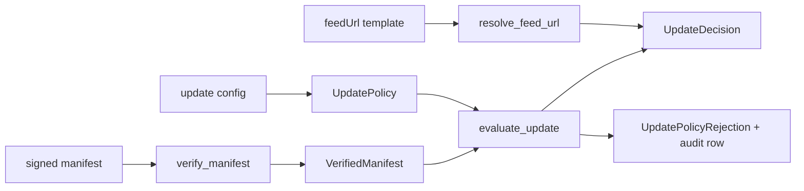

# Issue 88 Architecture: Channel Routing

## Mechanism

`native-updater` verifies the signed manifest first, then applies one pure `UpdatePolicy` gate that resolves the channel feed URL and returns either an accepted update decision or a typed rejection with the audit row the host must persist.

## Architecture Sketch

The updater has two decisions that must not be mixed: trust in the bytes and eligibility for this installed app. Signature verification owns trust. The channel router owns eligibility.

## Modules

| Module                             | Responsibility                                                                       | Public surface                                | Hides                                       | Invariant                                                                               | Mode            |
| ---------------------------------- | ------------------------------------------------------------------------------------ | --------------------------------------------- | ------------------------------------------- | --------------------------------------------------------------------------------------- | --------------- |
| `native-updater` manifest verifier | Parse and verify canonical Ed25519 manifests                                         | `verify_manifest`, `canonical_manifest_bytes` | Canonical JSON and key-window rules         | Unsigned or tampered manifests never become trusted metadata                            | Pure Rust       |
| `native-updater` channel router    | Apply configured channel, min-version, downgrade, rollback, and feed template policy | `resolve_feed_url`, `evaluate_update`         | Semver comparison and rollback window logic | A client only accepts eligible updates for its configured channel and installed version | Pure Rust       |
| `UpdatePolicyRejection`            | Carry a typed failure plus durable audit row data                                    | `error`, `audit` fields                       | Audit event naming and rejection context    | Rejections are observable without throwing or swallowing errors                         | Pure Rust value |

## State Placement

No new mutable state is introduced. Configured channel, installed version, min version, platform, and feed URL template are inputs. Manifest metadata is derived from signed bytes. Audit rows are returned as values for the host/runtime audit writer to persist.

## Ports And Adapters

There is no new I/O adapter in this slice. Network fetch, audit persistence, and install staging remain outside the crate. The only boundary is a pure Rust API that returns `Result<_, UpdatePolicyRejection>` instead of panicking or throwing.

## Lifecycle And Recovery

1. Resolve `{platform}` and `{channel}` into the configured feed URL.
2. Fetch manifest outside this crate.
3. Verify signature through `verify_manifest`.
4. Evaluate verified metadata through `evaluate_update`.
5. On rejection, persist the returned audit row and surface the typed error.
6. On acceptance, continue to artifact selection/download in later issues.

## Trade-Off

This trades early host integration for a smaller pure decision module, because the current repository has manifest verification but not the full updater fetch/install pipeline.

## Quality Notes

Testability is anchored by pure unit tests for every issue acceptance case. Reliability comes from using semver comparison instead of string comparison. Observability comes from returning audit rows with typed rejection tags. Security keeps signature trust separate from eligibility policy.

## Open Questions

None for this slice. Host-side audit persistence belongs to the later updater integration issue that wires this crate into the runtime service.

## Handoff

Design scope is locked directly to issue #88 because the GitHub issue already supplies the contract and test cases. Continue to `/review`.
