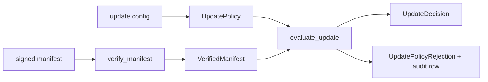

# Issue 88 PR

## PR

- Number: #264
- URL: https://github.com/Rika-Labs/effect-desktop/pull/264
- Title: Add updater channel routing policy

````markdown
## Summary

Adds a pure native-updater policy gate for channel routing, feed URL resolution, minVersion floors, downgrade refusal, and rollback windows after signed manifest verification. Rejections are returned as typed values with audit row context so callers can persist the denial without throwing or swallowing errors. The trade-off is keeping host fetch/install integration out of this slice because the current crate owns trust and eligibility, not network or staging I/O.

## Flow



Closes #88
````

## CI Status

- `validate (blacksmith-2vcpu-ubuntu-2404)` — pass, 2m58s.
- `validate (blacksmith-6vcpu-macos-latest)` — pass, 1m12s.
- `validate (blacksmith-2vcpu-windows-2025)` — pass, 2m22s.

Final status: all-green.

## Linked Issues

- Closes #88.

## Open Issues

None.

## Handoff

PR #264 is open. Continue to `/code-review`.
