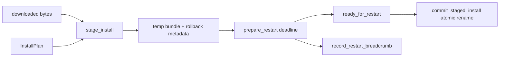

# Issue 89 Architecture: Install Staging

## Mechanism

`native-updater` owns an install-staging state machine that verifies downloaded bytes in a temp directory, records rollback/restart metadata as plain files, commits with one atomic rename, and returns typed failures for truncation, stale notarization, digest mismatch, and restart timeout.

## Architecture Sketch

The smallest safe slice is the native staging core. Fetching, platform restart, and host event transport remain adapters; the crate owns the invariant that bytes are verified before the commit point and that an ungraceful restart leaves a breadcrumb value on disk.

## Modules

| Module                  | Responsibility                                                         | Public surface | Hides                                 | Invariant                                           | Mode                                       |
| ----------------------- | ---------------------------------------------------------------------- | -------------- | ------------------------------------- | --------------------------------------------------- | ------------------------------------------ |
| `InstallPlan`           | Names the expected install bytes and versions                          | struct fields  | version/byte/digest contract          | Stage only the artifact the manifest described      | Pure Rust data                             |
| `InstallPaths`          | Names current, temp, rollback, and breadcrumb files                    | struct fields  | filesystem layout                     | Prior version and temp state live at explicit paths | Pure Rust data                             |
| `stage_install`         | Verify byte count and SHA-256, write temp bundle and rollback metadata | function       | temp-dir creation, cleanup on failure | Truncated or mismatched bytes never reach commit    | Effectful Rust I/O returning typed values  |
| `commit_staged_install` | Move staged bundle to current bundle path                              | function       | atomic rename detail                  | Commit point is one rename after verification       | Effectful Rust I/O returning typed values  |
| `restart_*` helpers     | Model `preparing-restart`, ready ack, timeout breadcrumb               | functions      | deadline math and breadcrumb shape    | Restart is graceful or observable                   | Pure/Effectful Rust returning typed values |

## State Placement

Persistent state is limited to files supplied by `InstallPaths`: current bundle bytes, staged temp bundle, rollback metadata, and recovery breadcrumb. The state machine does not own global process state; host/runtime adapters decide when to call it.

## Ports And Adapters

No network or OS restart adapter is added. Filesystem I/O is the only adapter in this slice and every operation returns `InstallStagingError` instead of panicking.

## Lifecycle And Recovery

1. Clean stale temp state when staging starts.
2. Reject truncated downloads before writing commit bytes.
3. Reject digest mismatch before writing commit bytes.
4. Write staged bundle and rollback metadata under the temp directory.
5. Emit a restart deadline value.
6. If the app acknowledges before the deadline, commit with atomic rename.
7. If the deadline expires, write a recovery breadcrumb and still allow the host to force restart.

## Trade-Off

This trades full host restart integration for a testable native staging core because the repository has updater contracts but no real updater host method yet.

## Quality Notes

Correctness is anchored by tests that assert the current bundle is unchanged on truncation and only changes after commit. Observability is anchored by a breadcrumb file for forced restarts. Security is anchored by digest verification before commit and by failing stale notarization as a typed value.

## Open Questions

Actual platform restart, macOS stapler invocation, and host event transport are deferred until the host updater method exists.

## Handoff

Design scope is locked directly to issue #89 because the issue body supplies the contract and verification cases. Continue to `/review`.
