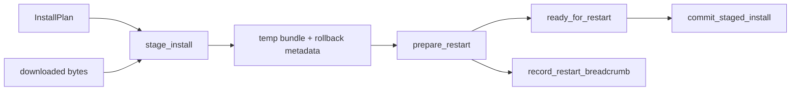

# Issue 89 PR

## PR

- Number: #277
- URL: https://github.com/Rika-Labs/effect-desktop/pull/277
- Title: Add updater install staging core

````markdown
## Summary

Adds the native-updater install-staging core for verified temp-dir staging, rollback metadata, restart deadlines, and recovery breadcrumbs. Expected update failures are returned as typed values, including truncated downloads and stale notarization, so callers can branch without throwing or swallowing errors. The trade-off is that this PR implements the native state machine before the host updater method wires real download, stapler, event, and restart adapters.

## Flow



Closes #89
````

## CI Status

Pending after PR creation.

## Linked Issues

- Closes #89.

## Open Issues

None.

## Handoff

PR #277 is open. Continue to `/code-review`.
