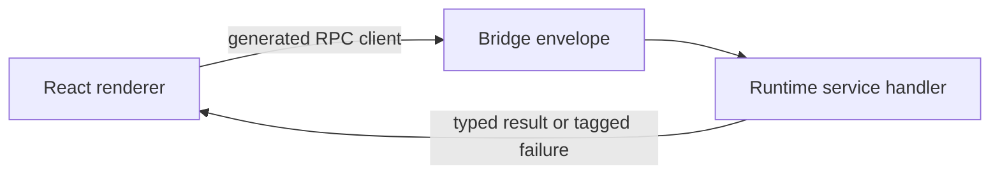

# Build your first app in 5 minutes

You will write three small files — an RPC contract, a runtime layer, and a React component — and see a typed call cross from the renderer to the runtime. No scaffolder, no magic.

This page lives inside the workspace, so every import path is `@orika/<pkg>` and every snippet is verified against the source you just cloned.

## The three pieces of an ORIKA app



1. **A contract** — an Effect `RpcGroup` with input/output schemas and tagged errors.
2. **A runtime** — an Effect `Layer` that implements the contract and any services it depends on.
3. **A renderer** — a React component that calls the contract through `useDesktop`.

That is the entire mental model. Everything else is policy on top of it.

## 1. The contract

Create `app/contracts.ts`:

```ts
import { Schema } from "effect"
import { Rpc, RpcGroup } from "effect/unstable/rpc"

export class GreetingError extends Schema.TaggedErrorClass<GreetingError>()("GreetingError", {
  reason: Schema.String
}) {}

export const Greeting = Rpc.make("Greeting.say", {
  payload: { name: Schema.String },
  success: Schema.Struct({ message: Schema.String }),
  error: GreetingError
})

export const AppRpcs = RpcGroup.make(Greeting)
```

`AppRpcs` is the source of truth: it carries method names, schemas, and the closed error set. The runtime, the bridge, the renderer client, and the test client all derive from this single value.

## 2. The runtime handler

Create `app/handlers.ts`:

```ts
import { Effect } from "effect"
import { AppRpcs } from "./contracts.js"

export const AppHandlersLive = AppRpcs.toLayer({
  "Greeting.say": ({ name }) => Effect.succeed({ message: `Hello, ${name}!` })
})
```

`RpcGroup.toLayer` produces a `Layer` that registers handlers for every method. If you forget one, TypeScript fails the build — that is your contract enforcement.

## 3. The desktop app and renderer manifest

Create `app/runtime-app.ts`. This file is runtime-only; do not import it from
renderer code.

```ts
import { Desktop } from "@orika/core"
import { AppHandlersLive } from "./handlers.js"
import { AppRpcs } from "./contracts.js"

export const App = Desktop.make({
  id: "dev.example.first-app",
  windows: Desktop.window("main", { title: "First App" }),
  rpcs: Desktop.rpc(AppRpcs, AppHandlersLive)
})
```

Create `app/renderer-manifest.ts` with only browser-safe data and RPC
descriptors:

```ts
import { AppRpcs } from "./contracts.js"

export const Manifest = {
  _tag: "DesktopAppManifest",
  id: "dev.example.first-app",
  windows: {
    main: { title: "First App", renderer: "/" }
  },
  rpcGroups: [{ _tag: "DesktopRpcGroup", group: AppRpcs }]
} as const
```

`Desktop.make` ties everything together: app id, declared windows, RPC surfaces, providers, permissions. Each `Desktop.window(id, spec, services?)` self-registers with the framework; compose multiple via `Desktop.windows(Desktop.window(...), Desktop.window(...))`. `Desktop.manifest` produces the value the renderer needs to know which contracts to expose.
Keep the renderer manifest's `id`, `windows`, and `rpcGroups` aligned with the
runtime app, but keep it in a browser-safe module. Importing the runtime app
module into a Vite renderer pulls runtime-only dependencies into the browser
bundle.

## 4. The renderer

Create `app/Greeter.tsx`:

```tsx
import { Option } from "effect"
import { AsyncResult, ReactDesktop } from "@orika/react"
import { Manifest } from "./renderer-manifest.js"
import { AppRpcs } from "./contracts.js"

const DesktopApp = ReactDesktop.from(Manifest)

export function Greeter() {
  const greeting = DesktopApp.useDesktop(AppRpcs)
  const say = greeting.say.useMutation()
  const result = AsyncResult.value(say.state)
  const error = AsyncResult.error(say.state)

  return (
    <form
      onSubmit={(event) => {
        event.preventDefault()
        const data = new FormData(event.currentTarget)
        say.run({ name: String(data.get("name") ?? "") })
      }}
    >
      <input name="name" placeholder="your name" />
      <button type="submit" disabled={say.status === "running"}>
        Greet
      </button>
      {Option.isSome(result) && <p>{result.value.message}</p>}
      {Option.isSome(error) && <p>Error: {error.value.reason}</p>}
    </form>
  )
}
```

`useDesktop(AppRpcs)` returns a typed object with one entry per RPC method. Each entry exposes `useMutation()` (for actions) or `useQuery()` (for reads). `say.state` is an `AsyncResult`: `AsyncResult.value(say.state)` is fully typed, and `AsyncResult.error(say.state)` carries the contract error.

## 5. Running it

There are two ways to run this today.

**Inside the workspace.** The `apps/inspector` app is already wired with a renderer, the manifest plumbing, and a working dev server. Drop `Greeter.tsx` into `apps/inspector/src` and import it from `App.tsx`, then:

```bash
cd apps/inspector
bun run dev
```

**As your own app.** Use the inspector as a reference and build a Vite + React renderer in a sibling directory. The renderer needs a `DesktopProvider` at the root, which `ReactDesktop.from(...).createRoot(<App />)` sets up for you. See [How-to: add a window](../how-to/add-a-window.md) for the renderer wiring.

## What you didn't have to do

- You didn't write a transport. The bridge serializes the call, names the method, propagates the trace id, and returns the typed reply.
- You didn't write a registry. `Desktop.make` keeps the runtime graph; the renderer reads the manifest.
- You didn't catch any exceptions. `GreetingError` is the only typed failure that can reach `AsyncResult.error(say.state)` — anything thrown is treated as a defect by Effect.
- You didn't ask for permission. `Greeting.say` reads no native authority. Once you add filesystem, processes, or secrets, the [permissions model](../explanation/permissions-model.md) kicks in.

## Next

- [Where to go next](next-steps.md) — pick a tutorial or recipe.
- Want to understand the boundaries you just crossed? Read [the boundary rule](../explanation/boundary-rule.md).
- Want to make this real? Continue with [Tutorial 01: build a notes app](../tutorials/01-build-a-notes-app.md).
