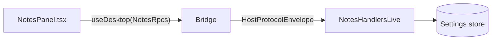

# Tutorial 01 — Build a notes app

You'll build a small notes application that:

- Stores notes in `Settings` (a typed key/value store backed by SQLite).
- Exposes typed RPC methods `Notes.list`, `Notes.save`, and `Notes.delete`.
- Renders a list and an editor in React using the framework's hooks.
- Handles failures as typed values rather than thrown exceptions.

By the end, you'll understand how every Effect Desktop app is shaped — contracts, services, layers, renderer hooks — and you'll have running code you can extend.

> **Prerequisites:** you completed [Install](../start/install.md) and ran the [first app](../start/first-app.md). You don't need prior Effect experience; this tutorial introduces the few primitives you'll touch.

## What you'll build



Three new files in `apps/inspector/src/`:

- `notes/contracts.ts` — `RpcGroup` with three methods and a tagged error.
- `notes/handlers.ts` — runtime layer that implements them against `Settings`.
- `notes/NotesPanel.tsx` — React UI that calls them.

Plus one edit to wire it into the inspector's existing manifest.

## Step 1 — Define the contract

Create `apps/inspector/src/notes/contracts.ts`:

```ts
import { Schema } from "effect"
import { Rpc, RpcGroup } from "effect/unstable/rpc"

export class Note extends Schema.Class<Note>("Note")({
  id: Schema.String,
  body: Schema.String,
  updatedAt: Schema.Number
}) {}

export class NoteNotFound extends Schema.TaggedError<NoteNotFound>()("NoteNotFound", {
  id: Schema.String
}) {}

export const NotesList = Rpc.make("Notes.list", {
  success: Schema.Array(Note)
})

export const NotesSave = Rpc.make("Notes.save", {
  payload: { id: Schema.String, body: Schema.String },
  success: Note
})

export const NotesDelete = Rpc.make("Notes.delete", {
  payload: { id: Schema.String },
  success: Schema.Void,
  error: NoteNotFound
})

export const NotesRpcs = RpcGroup.make(NotesList, NotesSave, NotesDelete)
```

What you just did:

- `Schema.Class` makes `Note` both a runtime type and a schema. The bridge will decode it on the wire.
- `Schema.TaggedError` makes `NoteNotFound` a closed failure shape. The renderer can match on the `_tag` exhaustively.
- `Rpc.make` declares each endpoint with payload, success, and (for delete) error.
- `RpcGroup.make` bundles them into a single value — the contract.

Notice `NotesList` and `NotesSave` declare no `error` — they'll only fail with the framework's own error union (network, decode, etc.). `NotesDelete` declares `NoteNotFound` because deleting a missing note is a domain failure your UI cares about.

## Step 2 — Implement the handlers

Create `apps/inspector/src/notes/handlers.ts`:

```ts
import { Effect, Schema } from "effect"
import { Settings } from "@effect-desktop/core"
import { NotesRpcs, Note, NoteNotFound } from "./contracts.js"

const NoteSchema = Schema.Array(Note)
const NOTES_KEY = "notes/all"

export const NotesHandlersLive = NotesRpcs.toLayer(
  Effect.gen(function* () {
    const settings = yield* Settings
    const store = yield* settings.open({
      path: "notes.sqlite",
      ownerScope: "window-main",
      schemaVersion: 1
    })

    return {
      "Notes.list": () => store.getOrDefault(NOTES_KEY, NoteSchema, []),

      "Notes.save": ({ id, body }) =>
        Effect.gen(function* () {
          const note = new Note({ id, body, updatedAt: Date.now() })
          yield* store.update(NOTES_KEY, NoteSchema, (existing) => {
            const others = existing.filter((n) => n.id !== id)
            return [...others, note]
          })
          return note
        }),

      "Notes.delete": ({ id }) =>
        Effect.gen(function* () {
          const before = yield* store.getOrDefault(NOTES_KEY, NoteSchema, [])
          if (!before.some((n) => n.id === id)) {
            return yield* Effect.fail(new NoteNotFound({ id }))
          }
          yield* store.update(NOTES_KEY, NoteSchema, (existing) =>
            existing.filter((n) => n.id !== id)
          )
        })
    }
  })
)
```

What's happening here:

- `RpcGroup.toLayer(effect)` accepts an Effect that builds the handler map. The Effect can `yield*` services — here it grabs `Settings` and opens a store — and the resulting handlers run inside the same scope.
- `Settings.open` returns a typed `Store`. We pass `ownerScope: "window-main"` so the store closes when the main window's scope closes (see [resource lifecycle](../explanation/resource-lifecycle.md)).
- `store.update(key, schema, fn)` runs inside a SQLite transaction. Concurrent saves on the same connection serialize automatically.
- The delete handler returns `Effect.fail(new NoteNotFound({ id }))` for the domain failure. TypeScript knows this is the only failure in the contract.

## Step 3 — Wire into the manifest

Edit the inspector's manifest (or your own app's equivalent). Find where `Desktop.make({ ... })` is called, and add `NotesRpcs` and `NotesHandlersLive` to the `rpcs` array:

```ts
import { Desktop } from "@effect-desktop/core"
import { NotesRpcs } from "./notes/contracts.js"
import { NotesHandlersLive } from "./notes/handlers.js"
// ... your other imports

export const App = Desktop.make({
  id: "dev.example.notes",
  windows: {
    main: { title: "Notes" }
  },
  rpcs: Desktop.rpc(NotesRpcs, NotesHandlersLive)
  // For multiple RPC surfaces, compose with Layer.mergeAll:
  //   rpcs: Layer.mergeAll(Desktop.rpc(NotesRpcs, NotesHandlersLive), Desktop.rpc(...))
})

export const Manifest = Desktop.manifest(App)
```

`Desktop.make` builds the runtime graph — settings, sqlite, permission registry, your handlers. `Desktop.manifest` produces the value the renderer reads to know what's callable.

## Step 4 — The React panel

Create `apps/inspector/src/notes/NotesPanel.tsx`:

```tsx
import { useState } from "react"
import { ReactDesktop } from "@effect-desktop/react"
import { Manifest } from "../manifest.js"
import { NotesRpcs } from "./contracts.js"

const DesktopApp = ReactDesktop.from(Manifest)

export function NotesPanel() {
  const notes = DesktopApp.useDesktop(NotesRpcs)
  const list = notes.list.useQuery()
  const save = notes.save.useMutation()
  const remove = notes.delete.useMutation()

  const [draft, setDraft] = useState("")

  const onAdd = async () => {
    if (!draft.trim()) return
    await save.run({ id: crypto.randomUUID(), body: draft })
    setDraft("")
    list.refetch()
  }

  const onDelete = async (id: string) => {
    await remove.run({ id })
    list.refetch()
  }

  if (list.status === "pending" || list.status === "loading") {
    return <p>Loading…</p>
  }
  if (list.status === "error") {
    return <p>Failed to load notes.</p>
  }

  return (
    <section>
      <h2>Notes</h2>

      <form
        onSubmit={(event) => {
          event.preventDefault()
          onAdd()
        }}
      >
        <textarea
          value={draft}
          onChange={(event) => setDraft(event.target.value)}
          placeholder="Write a note…"
        />
        <button type="submit" disabled={save.status === "running"}>
          {save.status === "running" ? "Saving…" : "Add"}
        </button>
      </form>

      <ul>
        {list.value.map((note) => (
          <li key={note.id}>
            <span>{note.body}</span>
            <button
              type="button"
              onClick={() => onDelete(note.id)}
              disabled={remove.status === "running"}
            >
              Delete
            </button>
          </li>
        ))}
      </ul>

      {remove.status === "error" && remove.error._tag === "NoteNotFound" && (
        <p>That note no longer exists. Refresh.</p>
      )}
    </section>
  )
}
```

Notes on the renderer code:

- `DesktopApp.useDesktop(NotesRpcs)` returns a typed object with one entry per RPC. Each entry exposes `useQuery()`, `useMutation()`, or `useStream()` depending on the endpoint kind.
- `useQuery()` fetches automatically on mount and exposes `status`, `value`, `error`, and `refetch`.
- `useMutation()` is fire-on-call: `save.run({ … })` returns a promise; `save.status` reflects the in-flight state.
- The error narrowing on `remove.error._tag === "NoteNotFound"` is exhaustive — TypeScript knows that's the only error.

Drop `<NotesPanel />` into the inspector's main component:

```tsx
// apps/inspector/src/App.tsx
import { NotesPanel } from "./notes/NotesPanel.js"
// ... wire it into the existing layout
```

## Step 5 — Run it

```bash
cd apps/inspector
bun run dev
```

Add a note. Reload the page. The note is still there — `Settings` persisted it to `notes.sqlite` in the app's data directory. Delete a note, then click delete on the same item again — you'll see "that note no longer exists" because the typed `NoteNotFound` error reached the UI cleanly.

## What just happened

You did three things that the framework rewards:

1. **Declared a contract once.** `NotesRpcs` is the source of truth. The renderer's typed client, the runtime handler signatures, and the bridge's Schema decoders all derive from it.
2. **Used a typed store with a scope.** `Settings.open(...)` is bound to `"window-main"`. When the user closes the window, the store closes. You did not write a finalizer.
3. **Failed as a value, not an exception.** `NoteNotFound` flowed from handler to bridge to renderer as a tagged value. No `try/catch`. The renderer matches on `_tag`.

## Where this leaves you

You can extend in many directions:

- **Search.** Add `Notes.search` with a `query: Schema.String` payload. Filter inside the handler. The renderer gets `notes.search.useQuery({ query })` for free.
- **Streams.** Replace `list.useQuery()` with a stream that emits whenever notes change. See [Tutorial 03](03-stream-from-the-runtime.md).
- **Multi-window.** Open a "compose" window from a button. See [Tutorial 02](02-add-a-second-window.md).
- **Sync.** Move to SQLite directly with `SqlClient` for richer queries. See [How-to: use SQLite](../how-to/use-sqlite.md).

## Related

- [Architecture overview](../explanation/architecture.md) — the three roles you just used
- [Layer-first design](../explanation/layer-first-design.md) — how `RpcGroup.toLayer` fits in
- Reference: [`Settings`](../reference/services/settings.md), [`Desktop` API](../reference/desktop-api.md), [React mutations](../reference/react/mutations.md)
