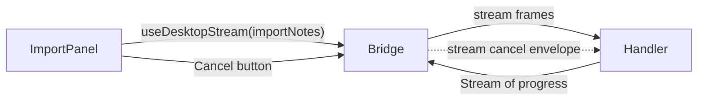

# Tutorial 03 — Stream from the runtime

Some operations don't fit a single request/response. Importing 10,000 records, watching a directory, tailing a process, running a multi-step build — these emit progress over time, possibly fail partway, and need to be cancellable. ORIKA's answer is **streams** as a first-class RPC kind, layered on Effect's `Stream` and `Scope` primitives.

In this tutorial you'll add an "import notes from a folder" feature that:

- Streams progress updates to the UI as files are read.
- Cancels cleanly if the user closes the window or clicks Cancel.
- Records each step as a typed audit event.
- Recovers gracefully from a single failed file without aborting the whole import.

> **Prerequisites:** you completed [Tutorial 01](01-build-a-notes-app.md).

## The shape of streaming RPC

A streaming RPC method returns a `Stream<A, E, R>` instead of an `Effect<A, E, R>`. The bridge knows how to chunk, frame, and deliver each item to the renderer. The renderer subscribes through the per-RPC `useStream(...)` hook (built on `useDesktopStream`) and gets a `StreamState<A, E>` with `{ status, data, error }`: `status` is `"idle" | "running" | "closed" | "failure"`, `data` is a bounded array of every emitted item, and `error` is `Option<Cause<E>>` populated only on failure.



## Step 1 — Declare the streaming method

Add to `apps/inspector/src/notes/contracts.ts`:

```ts
export class ImportProgress extends Schema.Class<ImportProgress>("ImportProgress")({
  kind: Schema.Literals(["started", "imported", "skipped", "completed"]),
  file: Schema.optional(Schema.String),
  imported: Schema.Number,
  skipped: Schema.Number,
  total: Schema.Number,
  message: Schema.optional(Schema.String)
}) {}

export const NotesImport = Rpc.make("Notes.import", {
  payload: { directory: Schema.String },
  success: ImportProgress,
  stream: true
})
```

The `stream: true` flag tells Effect RPC to model the success channel as a `Stream<ImportProgress, …>` rather than a single value. Add `NotesImport` to your `RpcGroup.make(...)` call.

## Step 2 — Implement the streaming handler

Add to `apps/inspector/src/notes/handlers.ts`:

```ts
import { Effect, Stream } from "effect"
import { Filesystem, SqlClient } from "@orika/core"
import { ImportProgress } from "./contracts.js"

// Inside the handlers map returned by NotesRpcs.toLayer:
"Notes.import": ({ directory }) =>
  Effect.gen(function* () {
    const fs = yield* Filesystem
    const sql = yield* SqlClient

    const entries = yield* fs.readDirectory(directory)
    const files = entries.filter((e) => e.kind === "file" && e.name.endsWith(".md"))
    const total = files.length

    return Stream.fromIterable(files).pipe(
      Stream.mapEffect((entry, index) =>
        Effect.gen(function* () {
          const body = new TextDecoder().decode(yield* fs.read(entry.path))
          const note = new Note({ id: entry.name, body, updatedAt: Date.now() })
          yield* sql`
            INSERT INTO notes (id, body, updated_at)
            VALUES (${note.id}, ${note.body}, ${note.updatedAt})
            ON CONFLICT(id) DO UPDATE SET
              body = excluded.body,
              updated_at = excluded.updated_at
          `
          return new ImportProgress({
            kind: "imported",
            file: entry.name,
            imported: index + 1,
            skipped: 0,
            total
          })
        }).pipe(
          Effect.catchAll((error) =>
            Effect.succeed(new ImportProgress({
              kind: "skipped",
              file: entry.name,
              imported: 0,
              skipped: 1,
              total,
              message: String(error)
            }))
          )
        )
      ),
      Stream.concat(
        Stream.succeed(new ImportProgress({
          kind: "completed",
          imported: 0,
          skipped: 0,
          total
        }))
      )
    )
  })
```

A few important things:

- `Filesystem` uses the current `ResourceOwner`, so the stream's file reads close with the owning app, window, or job scope.
- `Stream.mapEffect` runs each file as its own Effect. A failure on one file is **caught** and converted to a `skipped` progress event, so the whole import doesn't abort on a single bad file.
- The final `Stream.concat(Stream.succeed(...))` emits a `completed` event so the UI knows to stop.

## Step 3 — Subscribe in the UI

Create `apps/inspector/src/notes/ImportPanel.tsx`:

```tsx
import { useState } from "react"
import { Option } from "effect"
import { ReactDesktop } from "@orika/react"
import { Manifest } from "../renderer-manifest.js"
import { NotesRpcs } from "./contracts.js"

const DesktopApp = ReactDesktop.from(Manifest)

export function ImportPanel() {
  const notes = DesktopApp.useDesktop(NotesRpcs)
  const [directory, setDirectory] = useState("")
  const [enabled, setEnabled] = useState(false)

  const stream = notes.import.useStream(enabled ? { directory } : ({ directory: "" } as never), {
    capacity: 64
  })

  const latest = stream.data.at(-1)
  const completed = stream.data.find((item) => item.kind === "completed")
  const lastSkipped = latest?.kind === "skipped" ? latest : undefined

  return (
    <section>
      <h2>Import</h2>
      <input
        value={directory}
        onChange={(event) => setDirectory(event.target.value)}
        placeholder="/path/to/notes"
      />

      {!enabled && (
        <button onClick={() => setEnabled(true)} disabled={!directory}>
          Start import
        </button>
      )}

      {enabled && <button onClick={() => setEnabled(false)}>Cancel</button>}

      {stream.status === "running" && latest && (
        <progress max={latest.total} value={latest.imported + latest.skipped}>
          {latest.imported}/{latest.total}
        </progress>
      )}

      {lastSkipped && (
        <p>
          Skipped {lastSkipped.file}: {lastSkipped.message}
        </p>
      )}

      {stream.status === "closed" && completed && (
        <p>
          Done. Imported {completed.imported}, skipped {completed.skipped}.
        </p>
      )}

      {stream.status === "failure" && Option.isSome(stream.error) && <p>Import failed.</p>}
    </section>
  )
}
```

Three things to notice:

1. **`StreamState<A, E>` is cumulative.** `stream.data` is a bounded array of every emitted item — `data.at(-1)` is the most recent. `status` walks `"idle" -> "running" -> "closed"` on success, `-> "failure"` on error.
2. **`capacity: 64`** caps the buffered history. Older items are dropped once the array exceeds that length.
3. **Cancel by unmounting the subscription.** When `enabled` flips back, swap the hook call to a paused variant or unmount `<ImportPanel />` — the framework sends a `HostProtocolCancelByRequestEnvelope` to the runtime, which cancels the underlying Effect fiber and releases the scoped `Filesystem` reads. End to end.

## Step 4 — Declare the filesystem permission

`Filesystem.readDirectory` requires a declared root permission. At app startup (or in your manifest), declare which directory the import is allowed to read:

```ts
import { PermissionRegistry } from "@orika/core"

// During app init
const permissions = yield * PermissionRegistry
yield *
  permissions.declare(
    { kind: "filesystem.read", roots: [process.env.HOME + "/Documents"] },
    { effect: "approval", source: "Notes.import" }
  )
```

`effect: "approval"` means the user is prompted on first access. `source` shows up in the audit log. After the user grants once, subsequent reads under the same root proceed without re-prompting (per the [permissions model](../explanation/permissions-model.md)).

If you'd rather allow without prompting (development), use `effect: "allow"`. The audit event still fires.

## Step 5 — Run it

```bash
cd apps/inspector
bun run dev
```

Type a directory path, click Start. The progress bar updates as files import. Click Cancel mid-import — the stream stops cleanly and you see the file count where it stopped.

## What you got for the price of one streaming RPC

- **Backpressure.** The runtime won't out-pace the renderer. The bridge handles flow control.
- **Cancellation.** Closing the subscription cancels the Effect fiber and unwinds the scope.
- **Per-item failure handling.** A bad file is a skipped event, not a crash.
- **Observability.** The audit log records each filesystem read; devtools' event-log panel shows you the live stream of imports.
- **Type safety.** `stream.data` is `readonly ImportProgress[]`. TypeScript narrows each entry on `kind`.

## When to reach for a worker instead

Streaming RPC is the right answer when the renderer is the obvious consumer and the work doesn't need its own permission scope. When you want a separate worker runtime with its own declared capabilities, resource handle, and concurrency budget, use `Worker.spawn(...)`. The worker exposes a typed bidirectional channel; you can stream its output to the renderer through your own RPC bridge. It does not provide OS-enforced filesystem, network, CPU, or memory isolation.

Use `Worker` when:

- The work runs without a renderer attached (a background indexer).
- You need a narrower declared capability set than the runtime as a whole.
- You want a separately tracked resource so runaway work can be observed and terminated.

For in-runtime work that just needs cancellation, `Effect.fork` inside the handler scope plus `Schedule` for retry is enough — see [How-to: schedule background work](../how-to/schedule-background-jobs.md).

## Related

- Reference: [`Worker`](../reference/services/worker.md), [`Filesystem`](../reference/services/filesystem.md), [React streams](../reference/react/streams.md)
- [Permissions model](../explanation/permissions-model.md) — why the filesystem call needs a declaration
- [Resource lifecycle](../explanation/resource-lifecycle.md) — why cancellation Just Works
- How-to: [Schedule background jobs](../how-to/schedule-background-jobs.md)
