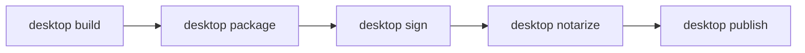

# Tutorial 04 — Package, sign, and ship

Your app runs in development. Now you'll take it through the release pipeline:

1. **Build** — produce the renderer bundle and the runtime entry.
2. **Package** — stage the platform-specific artifact (`.app`, `.msi`, `.AppImage`).
3. **Sign** — apply the platform signature with `codesign`, `signtool`, or `gpg`.
4. **Notarize** — submit to Apple's notary service (macOS only).
5. **Publish** — write the canonical signed update manifest.

Each step is its own CLI command with its own typed report. The framework treats each artifact as evidence — you can re-run a single step without rerunning the others.

> **Prerequisites:** an app you can build (e.g. the notes app from [Tutorial 01](01-build-a-notes-app.md)). Platform build tools installed (Xcode CLI tools on macOS, VS Build Tools on Windows, gcc + libgtk + libwebkit2gtk on Linux).

## The CLI's release pipeline at a glance



Each step reads `desktop.config.ts` and writes its outputs to a known location. The next step picks them up. You can stop after any step — `desktop sign` produces a signed but un-notarized artifact, fine for local distribution; `desktop notarize` is a separate step you only run for macOS releases.

## Step 1 — Configure

Create `desktop.config.ts` at the root of your app:

```ts
import { defineDesktopConfig } from "@orika/config"

export default defineDesktopConfig({
  app: {
    id: "dev.example.notes",
    name: "Notes",
    version: "0.1.0"
  },
  renderer: {
    framework: "react",
    entry: "src/main.tsx",
    dist: "dist"
  },
  runtime: {
    engine: "bun",
    entry: "src/runtime/main.ts"
  },
  build: {
    targets: ["macos-arm64", "macos-x64", "windows-x64", "linux-x64"]
  },
  signing: {
    macos: {
      identity: "Developer ID Application: Your Name (TEAMID)"
    },
    windows: {
      thumbprint: process.env.WINDOWS_CERT_THUMBPRINT
    }
  },
  update: {
    channel: "stable",
    keyVersion: 1,
    publicKey: "ed25519:<base64-public-key>",
    privateKeyEnv: "UPDATER_KEY_ENV_VAR",
    feedUrl: "https://updates.example.dev/{{channel}}/update-manifest.json"
  }
})
```

`defineDesktopConfig` is a typed identity function — it gives you autocomplete and compile-time validation against the canonical schema. See [Configuration reference](../reference/config.md) for every field.

## Step 2 — Build

```bash
bun run desktop build --config desktop.config.ts
```

What happens:

- The renderer entry is bundled through the app's build script. `renderer.framework` accepts React, Solid, or Vue and is recorded in the build report; Next apps use the `@orika/next` client adapter over React.
- The runtime entry is bundled with Bun.
- Build output is staged under `build/effect-desktop/<target>`.
- `runDesktopBuild` returns a `DesktopBuildReport` with `{ appId, appName, appVersion, target, layoutPath, steps, ... }`.

If the build fails, the CLI prints a typed `BuildPipelineError` — invalid config, missing entry, framework mismatch. Fix and re-run.

## Step 3 — Package

```bash
bun run desktop package --config desktop.config.ts
```

What happens, per declared target:

- macOS: stage a `.app` bundle, embed `Info.plist` and entitlements, copy the runtime and renderer.
- Windows: stage an `.msi` with embedded resources.
- Linux: produce AppImage, deb, and rpm artifacts (a fixed set).

Output is a list of artifacts in a typed `DesktopPackageReport`:

```
{
  artifacts: [
    { kind: "app", target: ..., artifactPath: "dist/desktop/macos-arm64/Notes.app", sizeBytes: 12345678, sha256: "..." },
    { kind: "app", target: ..., artifactPath: "dist/desktop/macos-x64/Notes.app", sizeBytes: 12345678, sha256: "..." },
    ...
  ]
}
```

The hash is **release evidence** — it pins exactly what bytes your sign step will operate on.

## Step 4 — Sign

```bash
bun run desktop sign --config desktop.config.ts
```

Per platform:

- macOS: `codesign --force --sign "Developer ID Application: …" --options runtime --entitlements <plist> Notes.app`.
- Windows: `signtool sign /sha1 <thumbprint> /tr <timestamp-server> /fd SHA256 Notes.msi`.
- Linux: optional GPG signature on the AppImage.

The CLI handles the platform tool invocations and PowerShell unblock for Windows. If signing fails (missing identity, expired cert, no keychain), the typed `SignPipelineError` tells you which artifact and which step.

You can also `bun run desktop sign --platform macos-arm64` to sign one target at a time, useful when iterating on a single platform.

## Step 5 — Notarize (macOS only)

Notarization submits the signed bundle to Apple's notary service for malware scanning. Releases distributed outside the App Store require it; the OS Gatekeeper check fails without it.

```bash
bun run desktop notarize --config desktop.config.ts
```

What happens:

- Each macOS artifact is uploaded to Apple via `xcrun notarytool submit`.
- The CLI waits for the result (typically 5-15 minutes).
- On success, `xcrun stapler staple` attaches the ticket so offline machines can verify it.
- The typed `DesktopNotarizeReport` records `{ kind, artifactPath, alreadyStapled, submissionId?, status?, assessed }` per artifact.

You'll need an Apple ID with notarization credentials. Set `APPLE_ID`, `APPLE_TEAM_ID`, and `APPLE_APP_SPECIFIC_PASSWORD` (an app-specific password) in the environment.

If notarization is rejected, the report names the artifact and the rejection reason. The most common cause is a missing entitlement; the CLI's hardened-runtime defaults are a good starting set.

## Step 6 — Publish the update manifest

The update manifest is the canonical signed JSON document that update clients check against. It binds version, channel, artifacts, hashes, and signatures together with an Ed25519 key.

```bash
bun run desktop publish --config desktop.config.ts --channel stable
```

Output: a signed `update-manifest.json` written to `dist/desktop/update-manifest.json`. Runtime manifest verification is executable through `Updater.check` when the app supplies the manifest JSON and Ed25519 trust anchors.

You upload the manifest and artifacts to your distribution host (S3, Cloudflare R2, GitHub Releases — the framework doesn't care). The update channel URL goes into your `Updater` configuration.

## Step 7 — Verify reproducibility

The CLI can re-run the package step and diff the result against a prior run, ensuring the build is reproducible:

```bash
bun run desktop check --repro --config desktop.config.ts
```

Reproducible builds are how you prove that the binary you signed is the binary built from a specific commit. The `--repro` check re-runs the package step and diffs the result against the on-disk artifacts; if the two builds produce byte-identical files, the check passes. If it fails, the report names the differing files.

This is optional for the first release but worth wiring into CI before you ship widely — it catches non-determinism (timestamps, build paths) before it becomes a supply-chain problem.

## Diagnose problems with `doctor`

If something in the pipeline fails strangely, run:

```bash
bun run desktop doctor
```

The doctor checks every prerequisite for every release step on the current platform — Bun version, Rust toolchain, codesign availability, notarytool credentials, signing identity, key paths. Each check returns a typed `{ name, status, component, message, evidence, remediation? }` row. Green across the board means the pipeline _can_ run; red rows tell you exactly what to fix.

## What the framework didn't ask you to do

You didn't write any of:

- A bundler config. The CLI knows your renderer framework and picks the right one.
- A platform packager. macOS bundling, Windows resource embedding, Linux AppImage — all handled.
- A signing wrapper. The CLI invokes the platform tool with the right arguments.
- A notarization poller. The CLI waits and reports.
- An update-manifest schema. The framework owns it; you just declare your keys.

What you _did_ do is declare the app, declare the platforms, and supply the secrets (keys, passwords) through environment variables.

## Where to go from here

- [How-to: package for macOS](../how-to/package-for-macos.md) — Apple-specific entitlement and stapling details.
- [How-to: sign and notarize](../how-to/sign-and-notarize.md) — full flag reference.
- [How-to: ship an update](../how-to/ship-an-update.md) — wiring the runtime updater.
- [How-to: diagnose with doctor](../how-to/diagnose-with-doctor.md) — common failures and fixes.
- Reference: [CLI commands](../reference/cli.md) — every flag.

## Related

- [Architecture overview](../explanation/architecture.md) — why packaging is split into discrete steps
- Reference: [`Updater`](../reference/native/updater.md), [Configuration](../reference/config.md)
