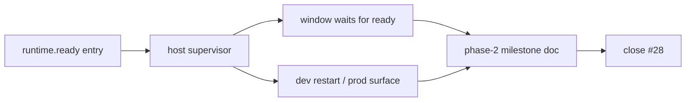

# Capture Phase 2 milestone record

## What we set out to do

The Phase 2 sub-issues had shipped and the epic checklist was complete, but the phase still needed the durable milestone record required by `AGENTS.md` and `engineering/SPEC.md` §28.4. The goal was to close the runtime-supervision epic with a factual completion document, not to change runtime behavior.

## What actually ended up working

The PR added `engineering/milestones/phase-2-runtime-supervision.md`, tying issues #29, #30, #31, and #33 back to §24.2. The document records the canonical Bun ready entry, Rust supervisor, platform cleanup, readiness gate, profile-aware restart policy, exact validation commands, and limitations that remain for Phase 3. The most important wording choice was to avoid claiming protocol readiness: Phase 2 proves supervised process lifecycle, not framed host-runtime communication.

## What surfaced in review

`/code-review` produced no findings, and `/address` found no unresolved threads. The useful pressure was in the pre-review pass: the milestone doc had to separate what Phase 2 truly proved from what Phase 3 will own. That kept the report from converting a process-supervision substrate into an implied protocol implementation.

## First-principles postmortem

The invariant was "the host owns the runtime process lifecycle." Phase 2 made that true through one supervisor state machine, but it did not make the runtime a protocol peer yet. The milestone record matters because it names the boundary precisely: ready, lifecycle events, crash restart policy, and cleanup are complete; framed transport, handshake methods, and reconnect are not.

## Game-theory postmortem

The local incentive after a successful phase is to write a victory summary that rounds up to the next abstraction. That is dangerous here because later phases depend on knowing whether a process is merely supervised or actually communicative. The milestone doc changes the incentive by making limitations explicit and durable, so future work starts from the real substrate instead of an optimistic memory of it.

## Non-obvious lesson

A supervised runtime is not yet a host protocol. The process can be launched, gated, observed, restarted, and cleaned up correctly while still having no framed request/response channel. Phase-completion docs need to preserve that distinction so the next phase does not inherit false assumptions.

## Reproducible pattern (if any)

When closing a substrate phase, name both the completed ownership invariant and the unimplemented higher-level contract.
Record the exact tests that prove the substrate.
Record the first phase that owns each deferred behavior.
Use the milestone doc to prevent phase-success language from expanding scope.

## AGENTS.md amendment candidate (if any)

Milestone docs should explicitly name the nearest higher-level abstraction that is still out of scope. Why: phase completion language can otherwise imply a capability the code has not implemented.

This is a proposal. Review and edit AGENTS.md yourself if you want to adopt it - `/learn` never auto-edits AGENTS.md.
