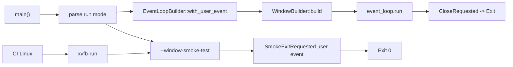

# Open Tao native window

## What we set out to do

Issue #8 set out to make the host binary open one empty Tao native window on
the platform main thread, with no WebView yet, and exit with code 0 when the
native close event fires. The invariant was deterministic lifecycle ownership:
the host owns the main-thread event loop, the window belongs to that loop, and
shutdown is tied to `WindowEvent::CloseRequested`.

## What actually ended up working

The issue architecture mostly held: `main` still owns Tao window startup, the
runtime remains window-only with no WebView, and `CloseRequested` maps to
`ControlFlow::Exit` for exit 0. What changed is that the final code deepened the
window boundary instead of keeping everything in `main.rs`: `crates/host/src/window.rs`
now owns `run_main_window`, event classification, and control-flow selection.

The important implementation shift was `EventLoopBuilder::<HostEvent>::with_user_event()`.
That enabled a hidden `--window-smoke-test` mode to exercise the same window
construction path in CI without waiting for a human close event. Commit
`35fd119` tightened that by asserting the observed exit source is
`window-smoke-test`, so the test proves the finite CI path, not just process
success.

CI also became part of the architecture: Linux runs the host smoke path and
workspace tests under `xvfb-run -a`. The GTK/glib advisory exemption was
re-reviewed for the narrower Tao window-only runtime, explicitly excluding
WebView, IPC, URL schemes, and HTML loading.

The original mermaid is directionally true for interactive use, but incomplete
for reality because it omits user events, smoke mode, and CI/Xvfb. Replacement:

## What surfaced in review

Review surfaced one real production-safety issue and one test-precision issue.
The major finding was that creating the first native Tao window crossed the
existing security exemption's re-review trigger in
`engineering/security/exemptions/2026-05-04-host-wry-gtk-stack.md`. That changed the
final branch: commit `0f6f14a` updated the exemption's scope, rationale,
validation evidence, and future re-review trigger so the native-window expansion
stayed explicit and auditable.

The minor finding was that the smoke test asserted the shared exit event
existed, but did not prove the event came from the smoke-test window path.
Commit `35fd119` tightened the assertion to require `source = "window-smoke-test"`,
making the test verify provenance instead of only shape.

A potential project-standards concern about wrapping `cargo test` in `xvfb-run`
was dropped during validation because `xvfb-run` is environment setup around the
same required gate command, not a replacement gate. Final triage: two addressed,
zero pushed back, zero escalated.

## First-principles postmortem

The invariant that mattered most was not "a window appears"; it was ownership of
native lifecycle by the main thread. Tao window construction, event-loop
execution, close-event handling, and process exit had to be one lifecycle owned
by the host binary.

The changed assumption was that this could be verified like ordinary startup.
It could not. Once `cargo run -p host` became an interactive event loop, the
canonical command was correct for humans but not finite for CI. The finite proof
needed a private event-loop exit source that still built the same window, plus
manual verification that the default close button drives the native close path.

## Game-theory postmortem

The local incentive was to keep the milestone small by treating native window
creation as only a functional change. That would have let the stale glib
advisory exemption survive past its own re-review trigger because no single GUI
step looked large enough to force renewed risk acceptance.

The review mechanism corrected that incentive. Expanding runtime exposure
required refreshed documentation of the accepted scope before the PR could
remain aligned with the system's security contract. The bad equilibrium avoided
was a pattern where each small GUI step inherited old security approval until
the host had accumulated a broader native attack surface than the exemption
actually described.

Future review should check two things sooner: whether a finite CI path proves
exactly what it claims, and whether any dependency exemption names a trigger
crossed by the milestone.

## Non-obvious lesson

Making the default host command real and interactive changed the CI contract:
`cargo run -p host` was no longer a finite proof once it opened a Tao event loop.
The correct move was not to special-case a fake path, but to add a private smoke
mode that shares the same window construction and exits through the event
system, then make the observable proof explicit with `source="window-smoke-test"`.
Review also exposed that security exemptions are live contracts: when code
crosses a stated re-review trigger, the exemption must be refreshed before the
change is complete.

## Reproducible pattern (if any)

Keep the user-facing command faithful to product behavior.
Add a private finite mode only when CI needs termination.
Share construction paths; vary only the exit trigger.
Log and assert the proof source, not just the success event.

## AGENTS.md amendment candidate (if any)

Security exemptions must be re-reviewed in the same PR that crosses any stated
trigger, with the new runtime scope and next trigger documented. Why: stale
exemptions silently convert narrow risk acceptance into broad permission.

This is a proposal. Review and edit AGENTS.md yourself if you want to adopt it -
`/learn` never auto-edits AGENTS.md.
