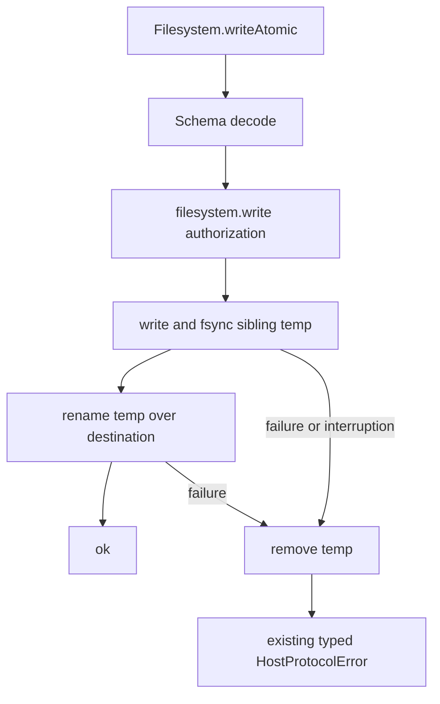

# Atomic write helper using temp file + rename, with platform fallbacks

## What we set out to do

Issue #100 asked for `Filesystem.writeAtomic(path, bytes)` so callers can replace a file without corrupting the previous contents on failed writes. The planned shape was sibling temp file, file sync, rename over destination, typed failures, and cleanup of interrupted temp writes.

## What actually ended up working

The shipped design adds `Filesystem.writeAtomic` to the existing filesystem service and consumes the same `filesystem.write` capability as normal writes. The implementation writes and syncs a sibling temp file, then uses rename as the commit point. Failures from temp write or rename are mapped through the existing `HostProtocolError` union, and the finalizer removes the temp file when the commit did not complete. The final code deliberately does not invent `PartialWrite` or `CrossVolumeRename` tags because the current closed protocol union does not expose them.

## What surfaced in review

No PR review comments were posted before merge. The main review finding came from local grounding before implementation: the issue text referenced `PartialWrite` and `CrossVolumeRename`, but those variants are not present in the protocol surface being implemented. That changed the final design from "match the issue prose exactly" to "ship the truthful primitive the current protocol can support."

## First-principles postmortem

The invariant is that the destination file changes only at the commit point. A direct write violates that invariant because write progress and destination state are the same object over time. A sibling temp file separates construction from publication: bytes can be incomplete in the temp file, while the destination remains old until rename succeeds. The error surface is a second invariant. In Effect-owned code, a failure must travel as typed data; pretending unsupported error variants exist would make the API less honest, not more correct.

## Game-theory postmortem

The local incentive was to satisfy the issue checklist by adding named errors and fallback behavior even when the repository had no protocol contract for them. That rewards appearance over runtime truth. The mechanism that improved alignment was grounding the requested behavior against `engineering/SPEC.md`, the bridge protocol, and the existing error union before writing code. The bad equilibrium avoided was a filesystem API that looks more complete than the host protocol can actually carry.

## Non-obvious lesson

Atomicity is not only an implementation detail; it is also a protocol truthfulness problem. A temp-file-and-rename helper can preserve destination contents with the current adapter, but richer claims like partial byte counts or cross-volume audit rows require explicit protocol variants and an audit sink before they can be implemented honestly.

## Reproducible pattern (if any)

For filesystem helpers:

1. Identify the single commit point for user-visible state.
2. Keep incomplete work in a sibling temp object until that point.
3. Cleanup on every non-commit exit with an Effect finalizer.
4. Map failures only to error variants the current protocol actually exposes.

## AGENTS.md amendment candidate (if any)

When an issue asks for a typed error or audit row that is absent from the closed protocol union, either add the protocol variant in scope or record the gap and return the nearest existing typed failure. Why: fabricated tags create a false contract between core and host.

This is a proposal. Review and edit AGENTS.md yourself if you want to adopt it -- `/learn` never auto-edits AGENTS.md.
