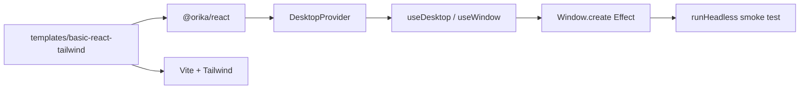

# templates/basic-react-tailwind populated: Tailwind, React 19, ESM, App.tsx with one useDesktop call

## What we set out to do

The issue required `templates/basic-react-tailwind` to become a real first-experience renderer template: Vite, React 19, Tailwind 4, public `@orika/*` imports only, a valid config, README, and a smoke path that exercises one typed desktop call.

## What actually ended up working

The template landed as a workspace package with its own Vite/Tailwind setup, `desktop.config.ts`, React source, README, and tests. The design had to add a narrow `@orika/react` public surface earlier than the next sub-issue, because a public-only template cannot honestly import `DesktopProvider`, `useDesktop`, or `useWindow` from a stub package. The shipped React surface is intentionally value-oriented: missing provider state returns `Option.none()` instead of throwing.

## What surfaced in review

Two review comments changed the final test design. The first exposed that URL path handling in the public-import guard was not portable to Windows; `fileURLToPath` became the filesystem boundary. The second exposed that the guard only checked `from "..."` imports and missed side-effect imports; the test now extracts both import forms and includes a regression fixture.

## First-principles postmortem

The invariant was not merely "the template has files." The invariant was "the template can be copied as the first app without teaching private imports or thrown missing-provider failures." That forced the work to create the smallest public React contract needed by the template, while deferring streams/resources and real renderer bridge construction to the next issue.

## Game-theory postmortem

The local shortcut was to let the template fake its own hook surface or rely on review discipline to catch private imports. Both moves create bad repeated-game incentives: templates become examples people copy, so any private import or throw-first hook pattern becomes framework guidance. The mechanism that aligned behavior was a source-level guard test plus value-returning hooks.

## Non-obvious lesson

Template work can reveal missing public API earlier than the package-internals issue that was supposed to own it. When that happens, the right move is not a private shim; it is a narrow public surface that models absence and failure explicitly, then leaves deeper behavior for the follow-up issue.

## Reproducible pattern (if any)

When a template must use a not-yet-deep public package:

1. Add only the public types and values the template needs to compile.
2. Represent unavailable runtime wiring as typed values, not thrown errors.
3. Add a template guard that checks both normal and side-effect imports.
4. Run the guard on all supported OSes, because path code is platform-sensitive.

## AGENTS.md amendment candidate (if any)

When adding template public-import guard tests, include side-effect import forms and use `fileURLToPath` for URL-to-filesystem conversion. Why: otherwise the guard can pass on macOS/Linux while failing or missing violations on Windows.

This is a proposal. Review and edit AGENTS.md yourself if you want to adopt it — `/learn` never auto-edits AGENTS.md.
