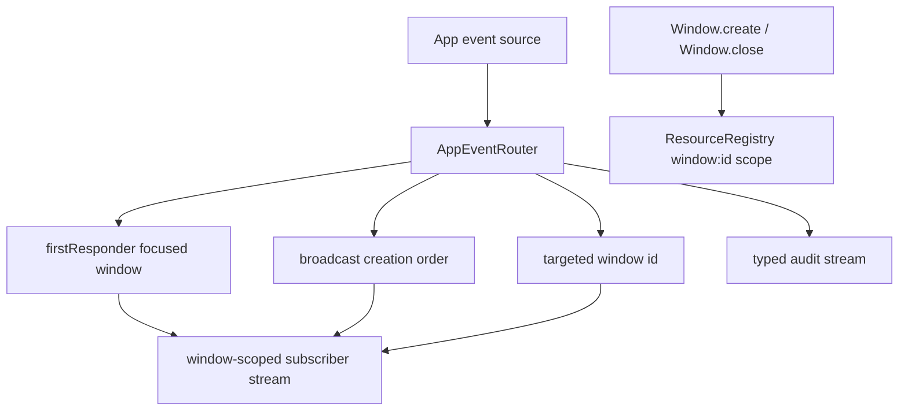

# Multi-window event routing per §8.8: per-window scopes; events scoped to the originating window

## What we set out to do

Issue #133 asked for one framework-owned routing policy for App-level events in multi-window apps: `firstResponder`, `broadcast`, and `targeted(windowId)`. It also required events scoped to a window to run under that window's child resource scope so cleanup follows window close.

## What actually ended up working

The shipped shape is a native in-process `AppEventRouter`, not an extension of the bridge `EventHub`. The router owns focused-window state, creation-order window state, one buffered first-responder event per event kind, subscriber queues, and typed audit rows for buffer eviction and closed targets. The host window adapter now registers windows under `window:<id>` scopes and closes that scope on `Window.close`, which makes resources created for the window dispose with the window.

## What surfaced in review

No review threads were opened. The local review pass checked that routing policy stayed in `@orika/native`, that bridge event fanout was not reused as App routing policy, and that the tests covered first-responder focus, max-one buffering, broadcast refusal short-circuiting, targeted closed-window audit, and per-window scope disposal.

## First-principles postmortem

The core invariant was not "events can be streamed"; it was "there is exactly one routing decision per App-level event." Keeping this out of `EventHub` matters because `EventHub` knows how to fan out contract envelopes, while §8.8 decides which window has authority to receive an App event. Those are separate policies and should not share mutable state.

## Game-theory postmortem

The bad local move is letting each future service encode its own window targeting rule. That would make early service work faster, but it creates an ecosystem where Tray, Notification, shortcuts, and open-file events drift. The router changes the payoff by giving future services a cheap typed route value and a shared audit path. Drops are observable, and broadcast cancellation uses a sequential dispatcher instead of relying on subscribers to coordinate.

## Non-obvious lesson

Bridge event fanout and App event routing look similar because both end in streams, but their invariants differ. Fanout is about envelope delivery to subscribers; routing is about authority, scope, ordering, and cancellation.

## Reproducible pattern (if any)

When a future native service has an owner window, pass `targetedRoute(ownerWindowId)` into `AppEventRouter`.
When an event can cancel a global action, use `dispatch` so handlers run sequentially and refusal short-circuits.
When an event has no target, emit a typed audit row rather than silently dropping it.

## AGENTS.md amendment candidate (if any)

Do not reuse a generic stream fanout primitive for a domain routing policy unless it owns the same invariant. Why: similar mechanics can hide different authority, ordering, and lifecycle rules.

This is a proposal. Review and edit AGENTS.md yourself if you want to adopt it — `/learn` never auto-edits AGENTS.md.
