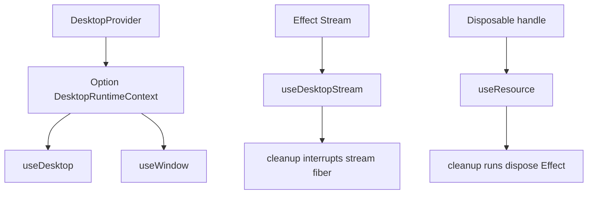

# DesktopProvider, useDesktop, useDesktopStream, useResource, useWindow in @orika/react

## What we set out to do

The issue asked `@orika/react` to expose the Phase 6.4 hook surface so renderer code does not hand-roll bridge wiring. The invariant was that React components should see provider absence, stream failure, current-window absence, and permission deferral as typed values, while stream fibers and resource handles are tied to React cleanup.

## What actually ended up working

The final shape is narrower than the issue sketch. `DesktopProvider` carries a `DesktopClient` and optional current `WindowHandle`; it does not yet carry a full Effect runtime because the client methods already return Effect values. `useDesktop` and `useWindow` return `Option` values, `useDesktopStream` forks a stream and interrupts the fiber from cleanup, `useResource` disposes a handle from cleanup, and `usePermission` exposes the Phase 16 deferred placeholder.

## What surfaced in review

Two review comments were addressed and no comments were pushed back. The first caught that wrapping a raw handle in `Option.some(handle)` on every render made `useResource` dispose stable resources on unrelated rerenders. The second caught that `useDesktopStream` subscribed only on `deps`, so a changed stream argument could leave the component consuming the old stream. Both comments changed the final implementation: raw handles are memoized into an `Option`, and the stream identity is part of the effect dependency list.

## First-principles postmortem

The invariant that mattered most was ownership: React owns component lifetime, Effect owns fiber/resource lifetime, and the hook is the boundary that must translate one lifetime into the other exactly once. The changed assumption was that "cleanup on unmount" is not enough; React also runs cleanup before rerunning an effect. Any unstable dependency created inside render can turn ordinary rerenders into resource teardown.

## Game-theory postmortem

The dangerous incentive is local convenience: wrapping inputs inline makes the hook easier to write but pushes hidden lifecycle cost onto app authors. Review aligned the incentives by treating dependency identity as part of the public contract, not a private React detail. The bad equilibrium avoided was a hook API that appears safe because it uses Effect cleanup, but leaks or over-disposes when callers rerender with stable handles or changed streams.

## Non-obvious lesson

Effect cleanup primitives are only as correct as the React dependency identity around them. Modeling failure as values prevents thrown render-path errors, but lifecycle correctness also requires that values used as dependencies are stable representations of the resource or subscription being owned.

## Reproducible pattern (if any)

For React hooks that own Effect resources, normalize caller input with `useMemo` before cleanup effects.
Always include the owned stream/resource identity in the effect dependency list.
Treat review comments about dependency arrays as lifecycle bugs, not style nits.

## AGENTS.md amendment candidate (if any)

For React hooks that own Effect fibers or resources, dependency identity is part of the ownership contract; Why: unstable wrapper values can convert rerenders into premature disposal or stale subscriptions.

This is a proposal. Review and edit AGENTS.md yourself if you want to adopt it — `/learn` never auto-edits AGENTS.md.
