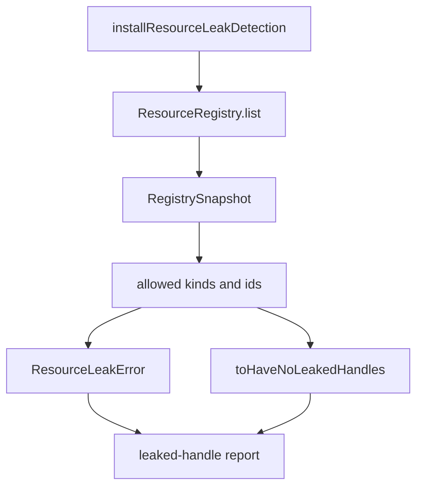

# Leak detection: bun-test custom matcher that fails when non-app handles outlive scope close

## What we set out to do

The issue asked for a test harness leak gate: tests should fail when non-app resource handles remain open, and the failure should name the leaked handle, its scope, and the originating test. The narrow implementation target was `@orika/test`, backed by the core `ResourceRegistry`.

## What actually ended up working

The shipped surface keeps leak detection in `@orika/test` and consumes the public `@orika/core` registry API. `assertNoOpenResources` reads `ResourceRegistry` from the Effect environment; `assertNoOpenResourcesIn` accepts an explicit registry for tests; `installResourceLeakDetection` wires the same assertion into Bun `afterEach`; and `toHaveNoLeakedHandles` renders the same report for snapshot assertions. The core package now exports the registry from its public barrel so the test package does not depend on private source paths.

## What surfaced in review

One review thread was addressed and resolved. The first implementation defaulted `ownerScope: "app"` as an allow-list entry. That would have exempted real non-app leaks, such as a `window` or `stream` owned by the app scope. The fix changed the allow-list to resource kinds and resource ids, with only `kind: "app"` allowed by default, and added a regression test proving an app-owned `window` still fails leak detection.

## First-principles postmortem

The invariant is about the resource, not the scope: non-app handles must be closed before a test can pass. Scope is diagnostic context in the report, not an exemption boundary. The other important boundary was error observability: the typed `ResourceLeakError` must put the report in `message`, because Bun afterEach failures show the thrown error message before any structured fields.

## Game-theory postmortem

The local incentive was to make the baseline allow-list broad enough that early tests would not fail on long-lived app state. That creates the wrong equilibrium: authors can hide leaks by registering them under an allowed scope. Kind/id allow-listing aligns behavior better because the permanent app handle is explicit while every other handle stays accountable. The review mechanism caught the disguised bypass while the implementation was still small.

## Non-obvious lesson

An allow-list for leak detection is a security boundary for tests. If it uses a broad ownership label like scope, it can become a disposal bypass. The allow-list should name the exact primitive being exempted: the app resource kind or a specific baseline handle id.

## Reproducible pattern (if any)

Default leak filters should allow by resource identity or resource kind, not by owner scope.
Thrown test-helper errors should put the human report in `message`, even when they also carry structured fields.
Every allow-list needs a negative test proving adjacent resources are still rejected.

## AGENTS.md amendment candidate (if any)

When adding leak-detection allow-lists, test that the allow-list does not exempt adjacent non-allowed resources sharing the same owner or scope. Why: broad ownership labels can hide the exact leaks the gate exists to catch.

This is a proposal. Review and edit AGENTS.md yourself if you want to adopt it -- `/learn` never auto-edits AGENTS.md.
