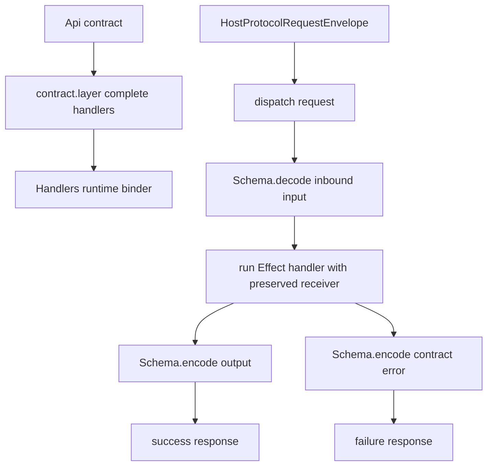

# Runtime handler codegen: wire Effect services to the bridge transport from the same contract

## What we set out to do

The goal was to bind runtime service handlers to API contracts so service implementations cannot drift from contract method names, input schemas, output schemas, or typed error schemas. The issue framed a generated Layer, but the current runtime still lacks the full transport lifecycle, so the useful primitive for this slice was an in-process dispatcher built from complete `contract.layer(...)` descriptors.

## What actually ended up working

`Handlers(...layers)` now builds a frozen runtime dispatcher in `@orika/bridge` and is exported as `Desktop.Handlers`. The binder reads each contract layer, constructs a method table, decodes request payloads through the input schema, runs the Effect handler, encodes successful outputs, and encodes contract failures into `{ kind: "failure", error }`. Host protocol defects such as unknown methods, malformed inputs, malformed outputs, and malformed contract errors remain typed `HostProtocolError` failures.

## What surfaced in review

One review finding changed the implementation. The initial dispatcher extracted handler functions from the original handler object and invoked them later from an internal table entry. That lost the original receiver, which regressed the contract registry's existing support for prototype handler methods. The fix wraps each table entry so it calls the handler with `layer.handlers` as `this`, and the regression test uses a prototype handler that reads instance state.

## First-principles postmortem

The primitive was not "generate a Layer"; it was "preserve the contract-to-handler mapping and boundary direction." A real Effect Layer would be shallow here because the runtime transport loop is still a later issue. The deep module is the dispatcher: it owns method lookup and all schema direction so later transport wiring has one safe path.

## Game-theory postmortem

The local shortcut was method extraction. It is convenient, type-checks, and passes object-literal handlers, but it makes prototype handlers pay the cost later. The mechanism that aligned incentives was the existing contract-layer invariant: handlers are frozen in place and may be prototype objects. Preserving the receiver in the binder keeps the cheap move safe for both object-literal and class-backed services.

## Non-obvious lesson

Completeness is not enough when handler objects can carry receiver state. A contract layer can prove every method exists, but generated dispatch must also preserve the invocation semantics of the object that supplied those methods.

## Reproducible pattern (if any)

When binding methods from a handler object:

- keep compile-time completeness in the contract layer;
- use a single dispatch table for lookup;
- call extracted methods with the original handler object as receiver;
- test one prototype/class handler that reads `this`.

## AGENTS.md amendment candidate (if any)

When generated code binds handler methods, include a prototype/class handler regression test that uses `this`. Why: object-literal tests cannot catch receiver loss.

This is a proposal. Review and edit AGENTS.md yourself if you want to adopt it — `/learn` never auto-edits AGENTS.md.
