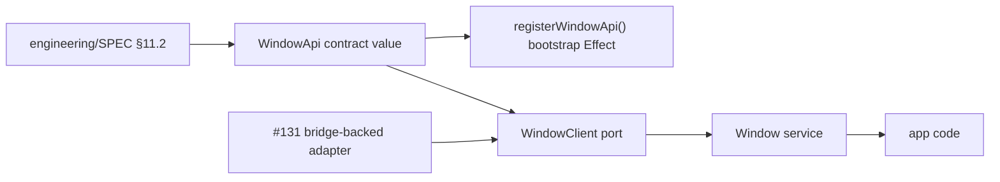

# Window service definition in @effect-desktop/native + matching contract in packages/bridge

## What we set out to do

Issue #130 asked for the Phase 5 `Window` surface to stop being theoretical: app code should be able to `yield* Window`, the service should expose the §11.2 method names, and the bridge contract should describe those methods with schemas. Host-backed method bodies, persistence, and multi-window routing stayed out of scope.

## What actually ended up working

The implementation made `@effect-desktop/native` own the public `Window` surface with three parts: `WindowApi` as the contract value, `WindowClient` as the substitutable port, and `Window` as the Effect service that delegates through the port. The original architecture assumed the contract could register itself globally at module import, but the final shape split pure contract declaration from explicit `registerWindowApi()` bootstrap registration. That preserves the contract surface without making package import order mutate global process state.

## What surfaced in review

Two review comments mattered. The `Context.Service` comment was pushed back because the installed Effect v4 package exposes `Context.Service`, while `Effect.Service` is absent; grounded package behavior overrode stale local wording. The optional `Window.create()` comment was valid: the public service allowed no-arg calls while the contract requires an object. The final service now normalizes `undefined` to `{}` once before calling the port.

## First-principles postmortem

The central invariant was that package import must be pure enough to survive any test order. A global registry freeze is a process-wide lifecycle boundary; registering contracts at import time silently couples module loading to lifecycle phase. The fix was to keep the data value pure and expose registration as an Effect so callers choose when lifecycle mutation happens and receive typed registry failures when they choose wrong.

## Game-theory postmortem

The risky local move was making the first implementation easy to consume by registering `Window` immediately. That saved one explicit bootstrap call but pushed hidden order dependence onto every test file and future package importer. The better mechanism makes mutation explicit: app/runtime bootstrap pays the one-time registration cost, while ordinary importers only read the contract. Normalizing optional public input at the service edge also keeps future adapters from each inventing their own fallback.

## Non-obvious lesson

Effect values are not enough if the module runs them at import time. In an Effect-first codebase, process-wide lifecycle mutation should be represented as an Effect and left for the owning bootstrap phase to execute; otherwise a typed failure can still become an import-time crash through `runSync`.

## Reproducible pattern (if any)

Define public contracts as pure exported values.
Expose global registration as an explicit Effect.
Normalize public convenience inputs at the deepest public service edge.
Keep bridge adapters strict against the contract.

## AGENTS.md amendment candidate (if any)

When adding global registry entries, define the contract as a pure value and expose registration as an explicit Effect; Why: import-time registration couples module load order to lifecycle freeze state.

This is a proposal. Review and edit AGENTS.md yourself if you want to adopt it — `/learn` never auto-edits AGENTS.md.
