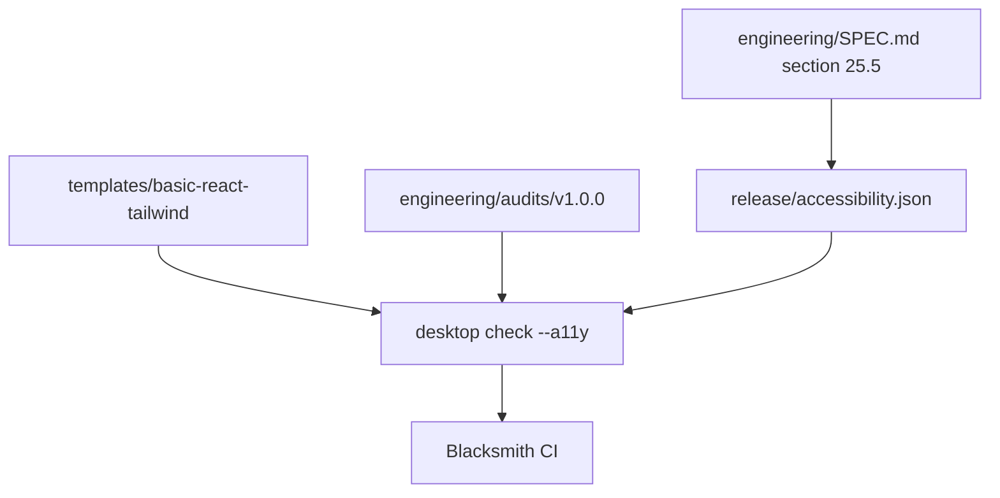

# Accessibility and localization gates

## What we set out to do

Issue #126 required the v1.0.0 release gate to enforce `engineering/SPEC.md` section 25.5: automated accessibility audits, manual keyboard evidence, externalized template strings, RTL example coverage, motion and color-scheme support, and WCAG contrast floors.

## What actually ended up working

The shipped shape mirrors the previous release gates: `release/accessibility.json` is the manifest, `desktop check --a11y` is the typed Effect verifier, `engineering/audits/v1.0.0/basic-react-tailwind/` holds recorded axe-core, Pa11y, keyboard, and RTL evidence, and CI runs the gate on Blacksmith. The basic React Tailwind template now keeps user-visible copy in `templateMessages`, includes Arabic copy for RTL evidence, respects reduced-motion and color-scheme media queries, and uses a darker button color that satisfies the 4.5:1 contrast floor.

## What surfaced in review

There were no external review comments. The local review loop found three useful failures before commit: the externalization scanner initially treated import specifiers and Tailwind class strings as user-visible English, the template window title was still hardcoded outside the message catalog, and the original emerald button color failed the declared contrast floor. Each failure improved the gate by separating source-code noise from real UI copy while still making actual user-visible literals and contrast violations loud.

## First-principles postmortem

The invariant was not "run an accessibility tool"; it was "the template cannot ship with unreviewed user-facing barriers." Tool outputs, manual artifacts, source string placement, and token checks are different evidence classes. Keeping them in one manifest made the promise reviewable without pretending this repo can generate a real release screencast during every headless CI run.

## Game-theory postmortem

The bad local move is to satisfy a release checklist with screenshots or prose that CI never checks. The opposite bad move is to add brittle static scanners that punish harmless code until contributors bypass them. The mechanism that aligned incentives was evidence-class validation: recorded audit files must be clean, manual evidence must be named, UI copy must live in the catalog, and false positives from imports/classes are excluded so the cheapest passing move is to fix the template rather than weaken the gate.

## Non-obvious lesson

Accessibility release gates need typed evidence classes just like supply-chain gates. Automated audit JSON, manual screencast evidence, source externalization, motion/color-scheme tokens, and contrast pairs each fail differently and need different validation rules.

## Reproducible pattern (if any)

Represent spec-required accessibility gates as a checked manifest.
Model every failure as a typed Effect error instead of throwing through CLI paths.
Add negative tests for hardcoded UI strings and contrast regressions.
Keep recorded manual evidence explicit when CI cannot truthfully produce it.

## AGENTS.md amendment candidate (if any)

When adding accessibility release gates, distinguish automated audit output, manual evidence, source externalization, and computed contrast as separate evidence classes. Why: combining them into one prose checklist hides which part is actually enforced.

This is a proposal. Review and edit AGENTS.md yourself if you want to adopt it -- `/learn` never auto-edits AGENTS.md.
