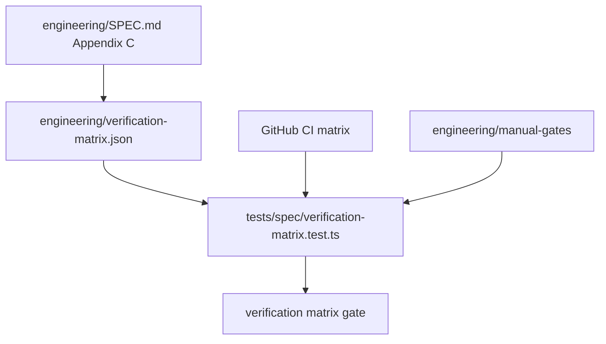

# Cross-platform verification matrix wired into CI as required cells

## What we set out to do

Issue #105 set out to make the §20.10 platform matrix observable in CI: required cells are `macos-arm64`, `macos-x64`, `windows-x64`, and `linux-x64`; optional ARM cells remain warn-only; headless rows run in CI; hardware or logged-in-session rows must be tracked as manual gates.

## What actually ended up working

The shipped shape is a small source-of-truth file, `engineering/verification-matrix.json`, plus a repo-level test that cross-checks the spec, the matrix, the GitHub workflow, and manual gate files. CI now names each Blacksmith-backed cell through `matrix.cell` and exposes it as `EFFECT_DESKTOP_MATRIX_CELL`, so the gate can fail when a workflow cell or declared matrix cell drifts. The only architecture change from the issue is that `macos-x64` is tracked as a manual-gated required cell until a real Blacksmith macOS x64 runner label exists for the repo.

## What surfaced in review

No PR review comments were posted for this cycle. The local review pass did catch one representational problem before commit: a hardware row originally carried only one `manualGate`, but `C.81` spans macOS, Windows, and Linux. The fix was to model `manualGates[]`, which makes each platform gate explicit and testable.

## First-principles postmortem

The invariant was not "CI has three jobs"; it was "every required cell is either executed by CI or blocked by a named manual gate." Treating the matrix as data made that invariant cheap to test. The important assumption that changed was macOS x64 availability: without a documented Blacksmith x64 runner label, the honest behavior is to represent the gap as a required manual gate instead of pretending the arm64 macOS runner proves both architectures.

## Game-theory postmortem

The release pipeline wants a binary green check, while reviewers want to trust that green means cross-platform coverage. The bad equilibrium is a vague manual checklist where unsupported cells silently decay because no file or test names the missing platform. The mechanism that improves alignment is a checked matrix artifact: local edits that add Appendix C rows, rename CI cells, or forget hardware gates now fail a test before release sign-off. Future review should check that every new platform gap is represented as data, not explained only in prose.

## Non-obvious lesson

A verification matrix is only useful when missing automation is first-class data. If a required cell cannot run today, the safer model is not to weaken the requirement; it is to make the gap explicit, give it a manual gate file, and test that the release process cannot forget it.

## Reproducible pattern (if any)

For spec-driven gates, keep one checked data artifact next to the spec. Test that artifact against both the normative spec text and the workflow that executes it. Represent unavailable automation as a named manual gate with a file path, not a comment.

## AGENTS.md amendment candidate (if any)

When a required CI or release cell cannot be automated yet, record it as a checked manual-gate artifact with the owning platform and reason. Why: prose-only release exceptions decay faster than data that CI validates.

This is a proposal. Review and edit AGENTS.md yourself if you want to adopt it — `/learn` never auto-edits AGENTS.md.
