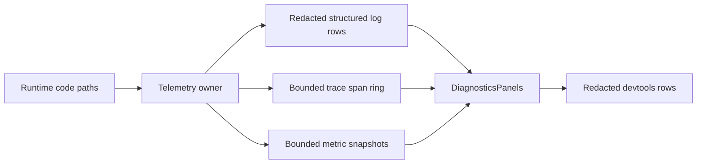

# Logs, traces, and metrics panels with redaction applied

## What we set out to do

Issue #22 asked for devtools logs, traces, and metrics panels that read from the runtime's diagnostic source of truth instead of a display-side buffer. The required invariants were structured log fields, redaction before display, trace rows from a bounded runtime trace ring, metric rows from the runtime aggregator, and an empty traces panel when tracing is explicitly disabled.

## What actually ended up working

The implementation introduced `Telemetry` in `@orika/core` as the owner of structured logs, trace spans, and metric snapshots. Logs are redacted before storage, traces live in a bounded ring with a default capacity of 10,000, and metrics aggregate counters and histograms by name and tags under a bounded snapshot map. `DiagnosticsPanels` in devtools stays a read-only projection: it asks `Telemetry` for one snapshot, groups trace spans by `traceId`, slices display rows, and applies the shared redaction filter before returning panel data.

## What surfaced in review

One automated Codex review comment found that the initial bounded append helper trusted `maxLogs` and `traceRingSize`; a value such as `0`, negative, or non-finite would make `slice(-maxRows)` violate the bounded-ring guarantee. The fix moved validation into `Telemetry.make`, added `maxMetrics`, and returns a typed `InvalidArgument` value for invalid buffer sizes rather than throwing or silently normalizing.

## First-principles postmortem

The invariant was not "devtools can show logs"; it was "devtools cannot invent diagnostics." That means the telemetry owner must exist before a panel is credible. The important assumption that changed during implementation was that metric cardinality is itself a runtime safety boundary. A trace ring can be bounded by length, but a metric map keyed by arbitrary tags needs the same explicit bound or a caller can create unbounded diagnostic state through high-cardinality tags.

## Game-theory postmortem

The tempting local move is to let configuration values pass through because tests use sane defaults. That rewards optimistic config and makes long-lived runtime memory growth a production discovery. The better mechanism is typed construction failure at the owner boundary: invalid retention settings are rejected before any diagnostic state exists. Future contributors get a clear signal that "disable" is a modeled option such as `tracingEnabled: false`, not a magic size like `0`.

## Non-obvious lesson

Every retention knob is part of the safety contract, not just an option. If a module promises a bounded ring or bounded map, the bound must be validated at construction and represented as typed failure. Silent clamping hides misconfiguration; accepting invalid values breaks the promise under exactly the conditions where diagnostics are most likely to run for a long time.

## Reproducible pattern (if any)

Validate bounded-buffer sizes before allocating state.
Use explicit disable switches instead of sentinel numeric capacities.
Keep owner-owned snapshots bounded at the same boundary that owns mutation.
Return typed construction failures for invalid observability config.

## AGENTS.md amendment candidate (if any)

When adding bounded diagnostic state, validate retention sizes as typed construction failures; Why: invalid observability configuration otherwise turns safety claims into memory-growth bugs.

This is a proposal. Review and edit AGENTS.md yourself if you want to adopt it — `/learn` never auto-edits AGENTS.md.
