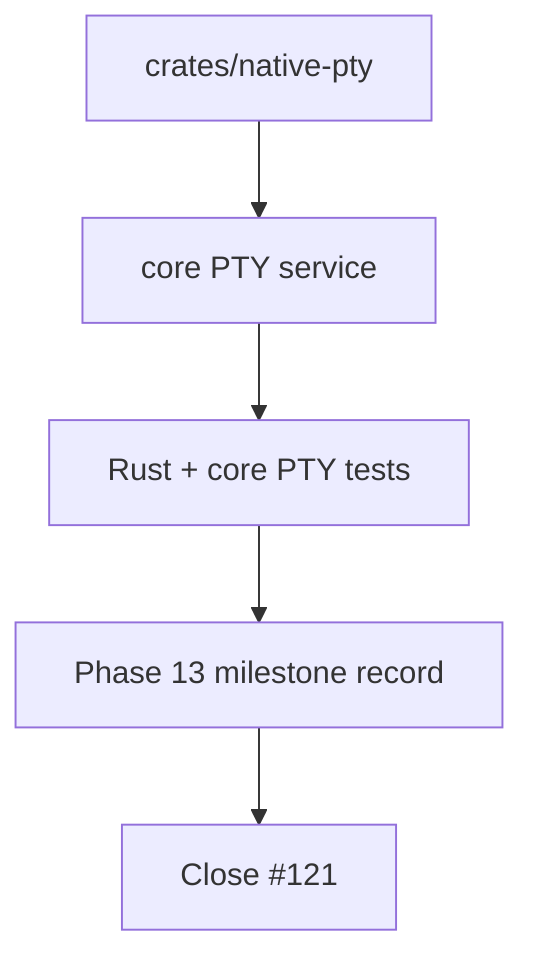

# Phase 13 PTY

## What we set out to do

Issue #121 was the Phase 13 epic closeout for cross-platform PTY support. The
native PTY crate, core Effect service, process-tree cleanup, and output
backpressure slices had already shipped; the remaining work was to capture one
durable milestone record that ties §24.13 acceptance criteria to Rust tests,
core tests, prior PRs, validation commands, and known limitations.

## What actually ended up working

The closeout stayed documentation-only. `engineering/milestones/phase-13-pty.md`
records the Rust and TypeScript surfaces separately, because Phase 13 spans both
`crates/native-pty` and `packages/core/src/runtime/pty.ts`. The file links the
four implementation PRs to acceptance evidence and explicitly states that
devtools visibility, release docs, dynamic permissions, and terminal emulator
semantics are later work.

## What surfaced in review

There were no review threads or comments. The local review pass checked that the
milestone does not overclaim the epic's `PtyForceKillTimeout` language as a
persisted audit event; the shipped implementation logs an Effect warning on that
condition, and the closeout records the actual test and implementation evidence.

## First-principles postmortem

PTY support crosses a harder boundary than the adjacent filesystem and process
phases. The proof has to cover both the platform primitive and the Effect-owned
lifecycle wrapper. Treating either side as the whole feature would hide the
actual invariant: the terminal child, kill domain, output stream, and scope
cleanup must behave as one owned resource.

## Game-theory postmortem

The tempting local move is to document only the core service because it is the
public TypeScript surface. That would make the Rust crate's platform behavior
harder to audit later. The milestone changes that incentive by making both sides
part of the closeout contract, so future PTY changes have to preserve the native
process-tree mechanism and the Effect lifecycle semantics together.

## Non-obvious lesson

When a phase spans Rust and TypeScript, the milestone needs to name both public
surfaces and both test suites. Otherwise the closeout can accidentally make one
side look like an implementation detail even when it owns a core invariant.

## Reproducible pattern (if any)

For cross-language phases, split milestone evidence by boundary: native
primitive, Effect service, tests for each, and the bridge between them. Record
known platform limitations in the closeout instead of hiding them behind a green
matrix.

## AGENTS.md amendment candidate (if any)

None.

This is a proposal. Review and edit AGENTS.md yourself if you want to adopt it —
`/learn` never auto-edits AGENTS.md.
