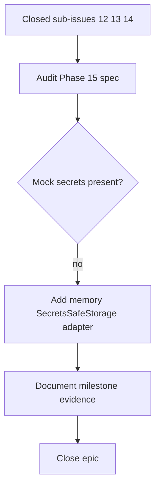

# Phase 15: Secrets

## What we set out to do

Close the Phase 15 epic after the Secrets service, redaction, and legacy plaintext migration sub-issues had merged, and produce the durable milestone record required by the repo workflow.

## What actually ended up working

The epic could not honestly close as a doc-only change because §24.15 also named "mock secrets" as a deliverable. The closure PR adds `makeMemorySecretsSafeStorage` to `@orika/test`, reusing the core-owned `SecretsSafeStorageApi` port rather than adding a new runtime abstraction. The milestone document then maps the phase deliverables, public APIs, Appendix C evidence, validation gate, known limitations, and follow-up phases to concrete files and PRs.

## What surfaced in review

The explicit code-review pass found no additional defects after the mock adapter and milestone doc were added. The useful review pressure came earlier, while comparing issue #5 against §24.15: the sub-issues were closed, but the named mock deliverable was only implemented as duplicated private helpers in tests.

## First-principles postmortem

The invariant for an epic closure is stronger than "all child issues are closed." The epic and spec are the source of truth for phase deliverables, while child issues are a slicing mechanism. A closure PR must audit the named deliverables directly and fill any gap before claiming the phase is complete.

## Game-theory postmortem

The local incentive is to trust checkbox state because it is fast and visible. That creates a bad equilibrium where small unsliced deliverables disappear at phase boundaries. The milestone document changes the payoff: every deliverable needs a file, a test, or an explicit limitation. Adding the memory secrets adapter made the missing work concrete instead of hiding it behind documentation.

## Non-obvious lesson

Epic closure is a verification task, not a clerical task. Sub-issue closure is useful evidence, but the closure agent must still read the spec and epic body because deliverables can exist outside the issue slice.

## Reproducible pattern (if any)

Before closing a phase epic, compare the spec deliverables against live artifacts.
Do not treat closed sub-issues as complete proof.
If a named deliverable is only present as private duplicated test code, extract the narrow reusable test helper.
Document future-phase limitations separately from completed current-phase work.

## AGENTS.md amendment candidate (if any)

Before closing a phase epic, audit the spec deliverables directly instead of relying only on sub-issue checkboxes. Why: issue slicing can omit small named deliverables that still matter for phase completion.

This is a proposal. Review and edit AGENTS.md yourself if you want to adopt it -- `/learn` never auto-edits AGENTS.md.
