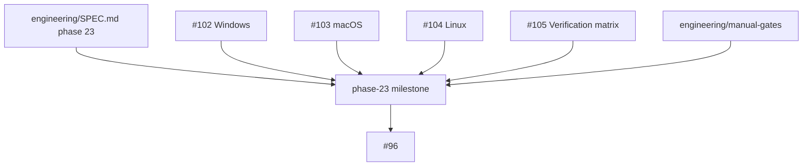

# Phase 23 Cross-platform hardening

## What we set out to do

Phase 23 was meant to make cross-platform behavior explicit and release-blocking: platform polish belongs behind the framework APIs, Appendix K support gaps must surface as typed capability results, and the §20.10 verification matrix must say which platform cells are automated versus manually gated.

## What actually ended up working

The implementation landed as four completed sub-issues rather than one large patch: Windows, macOS, Linux, and the verification matrix each got their own owner-owned evidence and tests. The closeout PR did not add new platform behavior; it added the milestone record tying those shipped changes to `engineering/SPEC.md` §24.23, `engineering/verification-matrix.json`, the platform host modules, and the manual-gate files. That matched the real architecture better than treating the epic as a single implementation surface.

## What surfaced in review

No review comments changed the PR. The review pass confirmed that the closeout stayed scoped to evidence, named manual limitations directly, and did not claim automation for cells that still depend on manual sign-off.

## First-principles postmortem

The important invariant was not "CI is green"; it was "each required platform cell has an explicit proof path." Some proof paths are automated Blacksmith jobs, while hardware and logged-in-session checks still require manual gate files. Treating both as first-class evidence keeps release confidence tied to observable facts instead of a vague platform-support claim.

## Game-theory postmortem

The local incentive in platform work is to let a green CI run stand in for cross-platform proof, because that makes the epic easy to close. The mechanism that improved alignment was forcing the milestone to name each evidence owner: platform modules, matrix data, tests, CI cells, and manual-gate files. That avoids the bad equilibrium where teams ship "supported on all platforms" while the hardest cells are undocumented and therefore easy to forget.

## Non-obvious lesson

Platform closeout should distinguish automated proof from manual proof in the durable record. A missing runner, hardware requirement, or logged-in-session dependency is not a footnote; it is part of the release contract until the matrix can automate it.

## Reproducible pattern (if any)

For platform epics, close with evidence rather than code. Map every sub-issue to the file or test that owns its proof. Name every unautomated required cell in the milestone's known limitations. Keep capability gaps typed in the platform module instead of allowing app code to infer support from the host OS.

## AGENTS.md amendment candidate (if any)

For cross-platform phase closeouts, every unautomated required cell should be named in the milestone's known limitations with its manual-gate file. Why: CI green should not erase platform evidence gaps.

This is a proposal. Review and edit AGENTS.md yourself if you want to adopt it -- `/learn` never auto-edits AGENTS.md.
