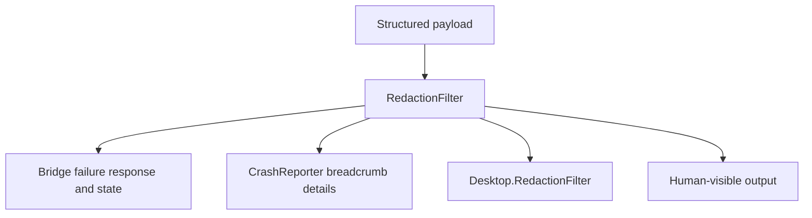

# Redaction in logs so secrets never appear in human-visible output

## What we set out to do

Issue #13 asked for the §14.10 redaction policy: structured fields matching secret-shaped names must be replaced with `"[REDACTED]"` before they reach logs, devtools, crash reports, audit export, or renderer-visible bridge error details.

## What actually ended up working

The first durable boundary is a pure `RedactionFilter` in `@orika/bridge`, the lowest shared package in the graph. It redacts nested records and arrays by field name, supports additional patterns and allowlisted paths, handles cycles, leaves byte arrays intact unless the containing field matches, and returns the original object when no field changes. The filter is wired into bridge failure responses and bridge failed-state emission, CrashReporter structured breadcrumb details, and the core `Desktop.RedactionFilter` facade.

## What surfaced in review

There were no PR review comments. Local review found one important scope constraint: `@orika/devtools`, `@orika/config`, and the CLI production checker are still Phase 0 stubs, so this PR cannot honestly wire real devtools panels or `bun desktop check --production` behavior without creating later-phase packages. The PR therefore ships the enforceable shared filter and the existing emission boundaries.

## First-principles postmortem

The invariant is not "every future sink is implemented now"; it is "every existing human-visible sink has one redaction primitive to call." Putting the filter in `bridge` avoids dependency cycles and makes it available to bridge, native, core, and future devtools/config code.

## Game-theory postmortem

The local incentive is to overclaim redaction by adding docs or tests for sinks that do not exist yet. That creates false production confidence. A better mechanism is to wire the real boundaries now and make future sink owners import the same primitive when their packages become real.

## Non-obvious lesson

A cross-cutting security primitive should live at the lowest package that every sink can depend on. In this repo that is `@orika/bridge`, not `core`, because bridge cannot import core and native already depends on bridge.

## Reproducible pattern (if any)

For cross-cutting security behavior, identify actual emission boundaries before writing adapters.
Put the pure primitive in the lowest acyclic package.
Wire existing sinks immediately.
Record future sinks as missing when their packages are still stubs.

## AGENTS.md amendment candidate (if any)

When an issue names future sinks that are still Phase 0 stubs, implement the shared primitive and current real boundaries, then record the missing sink explicitly. Why: pretending a nonexistent package is protected creates false security confidence.

This is a proposal. Review and edit AGENTS.md yourself if you want to adopt it - `/learn` never auto-edits AGENTS.md.
