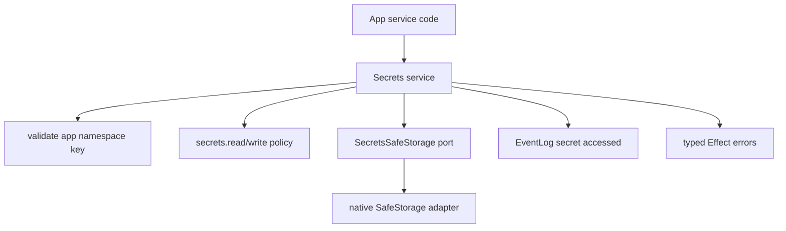

# Secrets service - set/get/delete keyed by app and namespace

## What we set out to do

Issue #12 asked for a core `Secrets` service that makes credential storage as cheap as `Settings`, but safer: app and namespace scoped keys, explicit read/write permissions, typed failures, trace spans, audit rows, unavailable-platform handling, and no plaintext secret leakage.

## What actually ended up working

The service landed as a core-owned Effect facade with `set`, `get`, `delete`, and `list`. It validates app id, namespace, and key before side effects; derives storage keys as `appId/namespace/key`; denies missing `secrets.read` or `secrets.write` namespace grants before touching storage; maps missing keys and unavailable storage into typed errors; emits `secret accessed` audit rows without secret bytes; and keeps returned bytes inside a redacted `SecretValue`.

The important architecture shift was replacing a direct `@orika/core -> @orika/native` import with a local `SecretsSafeStorage` port. Native SafeStorage can back the port, but core does not depend outward on the native package.

## What surfaced in review

There were no PR review comments. Local verification surfaced the critical finding: adding `@orika/native` as a dependency of `@orika/core` created a Turbo package cycle because native already depends on core. The fix changed the implementation boundary, not just the package file.

## First-principles postmortem

The invariant was that core owns runtime policy while native owns host-specific primitives. A direct import reversed that dependency direction and made core know too much about the native package. A port keeps the policy in core and the host adapter outside it.

## Game-theory postmortem

The local incentive was to reuse the existing SafeStorage `SecretValue` and service directly because it was already implemented and tested. That saved code in the short term but would reward future core runtime services for reaching outward into native packages. Turbo's cycle check aligned the incentive with the architecture: reuse behavior through a narrow port, not through an outward package dependency.

## Non-obvious lesson

Package graph checks are architecture tests. A service can be conceptually "over SafeStorage" without importing the SafeStorage package. When package direction matters, the stable contract is a local port plus adapter, not a direct dependency on the implementation package.

## Reproducible pattern (if any)

When a core runtime service needs a native primitive, define the smallest core-owned port.
Keep policy, validation, typed recovery, and audit in core.
Put native package adaptation outside core so dependency direction stays inward.
Treat Turbo cycle failures as design feedback, not build-system noise.

## AGENTS.md amendment candidate (if any)

Core services that depend on native capability must define a core-owned port instead of importing `@orika/native`. Why: direct imports create package cycles and move runtime policy toward host adapters.

This is a proposal. Review and edit AGENTS.md yourself if you want to adopt it - `/learn` never auto-edits AGENTS.md.
