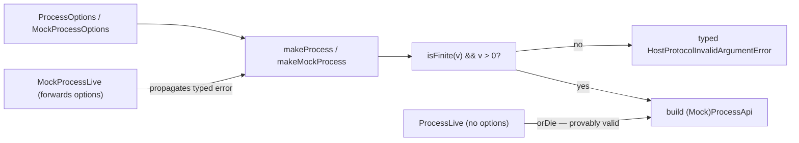

# Validate process shutdown windows — test-double error channels must mirror production

## What we set out to do

`makeProcess` accepted any number for `gracefulShutdownMs`, including `NaN`, `±Infinity`, `0`, and negatives, then defected at scope close when `Effect.timeoutOption(\`${v} millis\`)`parsed the malformed Duration string. Issue #650 closed that gap by validating at construction and surfacing a typed`HostProtocolInvalidArgumentError`before any child process spawned. The locked architecture proposed validation in`makeProcess`, an `Effect.orDie`in`ProcessLive`(defaults are provably valid), and typed-error propagation through`ProcessLayer`. `makeMockProcess`was specified to "mirror ProcessLive's treatment" via the same`Effect.orDie`.

## What actually ended up working

Implementation matched the architecture exactly for the production path: an 8-line guard at `process.ts:140` using `!Number.isFinite(v) || v <= 0`, with `Effect.fail(makeHostProtocolInvalidArgumentError("gracefulShutdownMs", "must be a finite positive number", "Process.make"))`. `ProcessLive` kept `Effect.orDie`; `ProcessLayer` propagated `HostProtocolInvalidArgumentError`. The API snapshot was updated as a separate `chore(api):` commit per the snapshot-freeze rule.

The architecture's `makeMockProcess` recommendation did NOT survive review. `/code-review` caught that the "mirrors ProcessLive's treatment" rationale was illusory: `ProcessLive` calls `makeProcess(registry)` with no options (provably valid defaults), but `makeMockProcess` exposes `gracefulShutdownMs` to test authors via `MockProcessOptions`. The address commit dropped `orDie` and propagated the typed error through four callers (`makeMockProcess` → `MockProcessLive` → `HeadlessRuntimeLive` → `makeHeadlessRuntimeContext`), widening their error unions and updating the @orika/test API snapshot.

Two new tests were added during /work; two more during /address (fractional positive `0.5`, default-fallback `makeProcess(registry)`). A summary-level major finding (pty.ts has identical defect) became follow-up issue #709 rather than scope expansion.

## What surfaced in review

Three inline threads, all Address, zero pushback, zero escalation: (1) predicate divergence from `contracts.ts` ms idiom — addressed by adding a fractional positive test that pins the deliberate divergence; (2) `Effect.orDie` swallowed typed error for user-supplied `gracefulShutdownMs` — addressed by removing `orDie` and propagating the typed error through 4 callers; (3) missing default-fallback positive test — addressed by adding `makeProcess(registry)` accept test. One summary-level major (pty.ts parallel defect, flagged independently by two reviewers) became follow-up issue #709. One nit (test.each pattern) skipped — would introduce a new pattern for one file. The single review pass changed code in three places and the API snapshot.

## First-principles postmortem

The invariant that mattered: every `gracefulShutdownMs` value reaching `Effect.timeoutOption(\`${v} millis\`)`must be a finite positive Duration. The assumption that changed mid-cycle: "production and mock can both safely use`Effect.orDie`because they share defaults." Wrong. The mock exposes the validated option to test authors via`MockProcessOptions.gracefulShutdownMs`; production `ProcessLive` does not. The source-of-truth thing that became clearer: a test double's error channel is not determined by what the production module looks like — it is determined by which inputs the test double itself accepts from callers. Symmetry between production and mock is a property of their input surfaces, not a property of their construction code.

## Game-theory postmortem

Players: architect, reviewer, code-reviewer, implementer (one agent, four hats). Information asymmetry: `/architect` claimed "mock mirrors ProcessLive's treatment" without grounding the claim against `MockProcessOptions`. `/review` reading prose had no incentive to grep for `gracefulShutdownMs` in `packages/test/src/index.ts`. `/code-review`, which grounds every claim at `file:line`, caught the symmetry illusion. This repeats the equilibrium described in `2026-05-07-require-integer-bridge-timing-metadata.md` exactly: `/architect` and `/review` run on prose; `/code-review` runs on diff. Bad equilibrium discovered: the bug class (unvalidated `gracefulShutdownMs` → `Effect.timeoutOption` defect) survives in `pty.ts:155` — issue #650 was titled "process shutdown windows" (singular), so the scoping was honest, but a `/scout` step that grepped for the bug class pattern (`rg "Effect\.timeoutOption\(\`\\\$\{.\*Ms\}"`) would have surfaced #709's case during the original cycle. The mechanism that aligned behavior: `/code-review`'s file-grounded reviewer prompts found two architecture rationalizations that survived four prior stages.

## Non-obvious lesson

When adding validation to a `make<X>` constructor that returns `Effect<..., E, ...>`, the matching `makeMock<X>` is not symmetric with `<X>Live` by default. `<X>Live` typically calls `make<X>(registry)` with no options — its error channel can collapse to `never` honestly via `Effect.orDie`. `makeMock<X>` typically exposes the same options surface to test authors via `Mock<X>Options` — its error channel must propagate `E` because invalid input is now reachable from caller code. The /architect rationale "mock mirrors live's treatment" sounds principled but ignores the asymmetric input surface. The cost of fixing it later is mechanical: error unions widen across 4 callers and the API snapshot regenerates.

## Reproducible pattern (if any)

When the architecture pairs a new validated `make<X>` with an existing `makeMock<X>`:

1. Read `Mock<X>Options` to see whether the validated option is exposed to callers.
2. If exposed: `makeMock<X>` must return `Effect<MockApi, E, ...>` and `Mock<X>Live` must return `Layer<X, E, ...>`. No `Effect.orDie`.
3. If hardcoded / ignored: `Effect.orDie` is honest and the mock's error channel can stay `never`.
4. Audit downstream Layer/Context callers and widen error unions accordingly. Regenerate the API snapshot in a separate `chore(api):` commit.

When fixing a numeric-validation bug used as a Duration string interpolation:

5. Grep the bug class before scoping the issue: `rg "Effect\.timeoutOption\(\`\\\$\{.\*Ms\}"`. Every site is a candidate.

## AGENTS.md amendment candidate (if any)

When adding typed-error validation to a `make<X>` constructor, audit the matching `makeMock<X>` and propagate the typed error channel if the mock exposes the same option to callers; only use `Effect.orDie` when the mock provably hard-codes valid input. Why: PR #708's symmetry-by-orDie shape passed /architect and /review unchallenged because both stages run on prose; /code-review caught the illusion only by grounding against `MockProcessOptions.gracefulShutdownMs`.

This is a proposal. Review and edit AGENTS.md yourself if you want to adopt it — `/learn` never auto-edits AGENTS.md.
