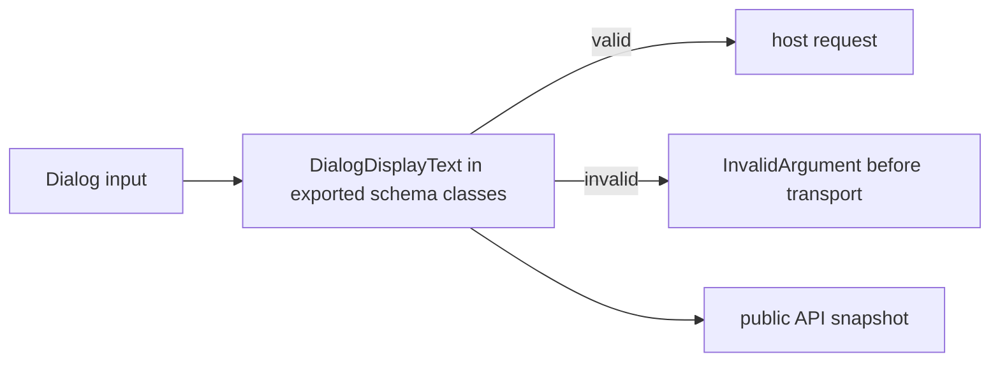

# Validate Dialog native UI text fields

## What we set out to do

Dialog methods accepted control bytes in platform-visible strings and forwarded them to the host. The goal was one native-dialog display-string schema shared by message, confirm, open, and save dialog text fields, with invalid text failing as `InvalidArgument` before bridge transport.

## What actually ended up working

The implementation put a private `DialogDisplayText` schema in `packages/native/src/contracts/dialog.ts`, then used it directly in every exported Dialog input schema that contains platform-visible text. Optional titles and labels remain optional, but when present they must be non-empty and free of ASCII control bytes. The bridge-client test now exercises file dialog titles, message title/message/detail, confirm title/message/detail, and button labels, and asserts the exchange receives no request for invalid input.

## What surfaced in review

No review threads were opened. CI caught the missing public API snapshot update after the first PR head: the exported `Schema.Class` signatures changed from `Schema.String` / `Schema.NonEmptyString` to `DialogDisplayText`. The fix was a separate `chore(api)` commit that regenerated `api/snapshots/@orika__native.snapshot.json`.

## First-principles postmortem

The primitive is not "a string"; it is "a native UI display string." Once the schema names that primitive, every exported schema class that uses it changes the public contract, even if the helper itself is private. The source of truth for the runtime boundary is the schema file; the source of truth for the release boundary is the API snapshot. Both had to move together.

## Game-theory postmortem

The local shortcut was to treat a stricter schema as an internal implementation detail because the TypeScript options still appear as strings to consumers. The global cost is a public API gate that no longer matches the contract users actually get. The snapshot gate aligned incentives by forcing the PR to say, in a durable file, that Dialog text inputs now have a narrower runtime contract.

## Non-obvious lesson

In this repo, validation changes inside exported `Schema.Class` declarations are public API changes. Even when TypeScript still exposes the field as `string`, the schema signature is part of the package contract and must be snapshotted.

## Reproducible pattern (if any)

When tightening a native contract schema, run `bun packages/cli/src/bin.ts check --api` before opening the PR.
If exported schema signatures change, regenerate the package snapshot in a separate `chore(api)` commit.
Use the regression test to prove invalid input stops before transport, not only that the schema rejects it in isolation.

## AGENTS.md amendment candidate (if any)

When a change modifies an exported `Schema.Class` declaration, run the public API snapshot check before PR and commit any intentional snapshot delta separately. Why: schema helper changes are release-contract changes even when the TypeScript field type remains `string`.

This is a proposal. Review and edit AGENTS.md yourself if you want to adopt it — `/learn` never auto-edits AGENTS.md.
