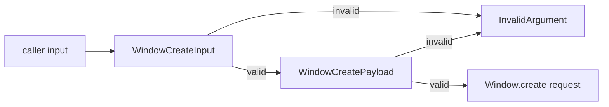

# Validate Window.create chrome inputs

## What we set out to do

Issue #806 showed that `Window.create` accepted impossible chrome values and still sent a successful host request. The intended architecture was to reject malformed title, vibrancy, and traffic-light inputs at the SDK schema boundary before bridge transport, while preserving valid macOS polish payloads.

## What actually ended up working

The final implementation tightened the existing schemas instead of adding a separate validator. `WindowCreateInput` in `@orika/native` now rejects empty supplied titles, unsupported vibrancy materials, and negative traffic-light coordinates. `WindowCreatePayload` in `@orika/bridge` mirrors the same runtime contract so direct bridge callers cannot bypass the SDK boundary. The tests assert both failure and non-transport by checking that the host exchange records no request for malformed chrome.

## What surfaced in review

The local `/code-review` pass found no code findings. CI surfaced the meaningful review signal: `bun desktop check --api` failed because the schema constraints changed exported signatures. That failure was correct; the PR needed to update the public API snapshots to make the intentional contract change observable.

## First-principles postmortem

The core invariant is that invalid native chrome must fail before host I/O. The issue framed this as SDK validation, but the lower bridge encoder is also a request-construction boundary. Keeping both schemas aligned prevents a split-brain contract where framework code is safe and direct bridge code can still emit impossible envelopes. The assumption that schema refinements are just implementation detail was wrong; exported schema classes are part of the public API evidence in this repo.

## Game-theory postmortem

The bad local move is to tighten validation and leave the snapshot gate for CI to catch later. The player under time pressure sees local tests pass and may treat the API checker as release bureaucracy, but consumers and future reviewers pay the cost when runtime contracts drift without a recorded public signature change. The snapshot mechanism makes the honest move cheaper: if validation changes an exported schema, the API evidence must change in the same PR.

## Non-obvious lesson

In this repo, tightening a runtime schema can be a public API change even when TypeScript still prints the field as `string` at use sites. The exported `Schema.Class` signature is tracked as API evidence, so boundary hardening needs both regression tests and snapshot updates.

## Reproducible pattern

When changing exported schema constraints:

1. Add a failing transport-boundary regression test.
2. Update the schema.
3. Run `bun packages/cli/src/bin.ts check --api --write`.
4. Run `bun packages/cli/src/bin.ts check --api`.
5. Commit the snapshot delta with the behavior change.

## AGENTS.md amendment candidate (if any)

Exported schema constraint changes must update public API snapshots in the same PR. Why: schema classes are tracked API evidence, and CI should confirm an intentional contract change rather than discover an omitted snapshot.

This is a proposal. Review and edit AGENTS.md yourself if you want to adopt it — `/learn` never auto-edits AGENTS.md.
